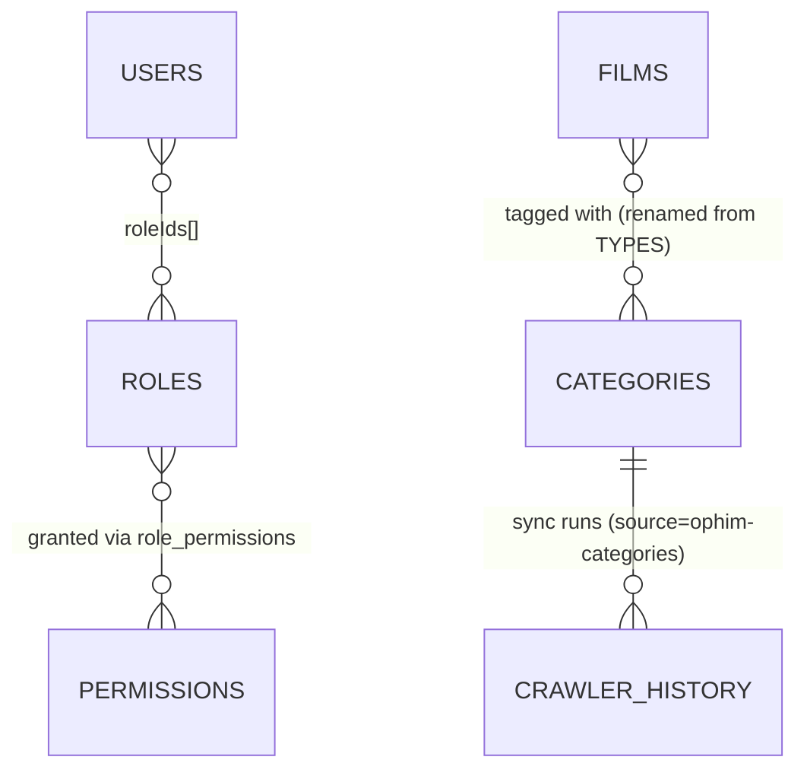

# RoPhim — Enterprise REST API Design

Design-only reference (no implementation). Base URL: `/api/v1`.

**Revision 2 changelog**: added full RBAC (Roles/Permissions), added a real `Categories` module backed by Ophim's `https://ophim1.com/the-loai` (supersedes the "keep as Types" call in rev 1 — see §1.3), retrofitted every endpoint with an explicit Access + Permission spec, expanded Dashboard stats, updated the final summary table.

**Revision 3 changelog**: cross-referenced the original requirement spreadsheet ([Google Sheet](https://docs.google.com/spreadsheets/d/1BQPNftDjPaatJssQfZUDh5de6GncC1Tp2i8qUDm0Pq4)) row-by-row against every endpoint designed so far. Found and fixed one regression (Categories lost the `isHot`/"thể loại hot" feature when renamed from `types` in rev 2 — restored, §8), found one genuine gap (no way to discover "phim có bình luận sôi nổi" — films ranked by comment activity — added `GET /films/most-commented`, §6), and clarified one ambiguous mapping ("bình luận yêu thích nhất" → top **rated** films, not a comment endpoint — added a `metric` param to `GET /films/top` rather than a new route). Everything else in the sheet already maps cleanly to existing endpoints — see the traceability table below.

**Revision 4 changelog** (this pass — final review as Senior Solution Architect + Product Owner): re-confirmed the requirement sheet is **100% covered** (zero new sheet-vs-API gaps beyond rev 3's fixes — see the updated note at the end of the traceability table). This pass instead audited *enterprise-readiness* dimensions the sheet itself doesn't spell out but a production API needs: CRUD completeness per collection, data states, validation, error responses, and cross-module business flows. Found and fixed: **7 missing endpoints** (`POST /users`, `PATCH /comments/:id`, `PATCH /comments/:id/visibility`, `DELETE /film-reports/:id`, `PATCH /avatars/types/:id`, `PATCH /avatars/images/:id`, `GET /roles/:id/users`), **2 new data states** (`Film.isPublished` — resolves rev 1's unresolved delete-cascade concern with a soft-hide instead — and `Comment.isHidden`), **1 enum extension** (`FilmReportStatus` gains `rejected`), **2 new permissions** (`comments:update`, `film-reports:delete`), a consolidated **error-message catalog** and **validation quick-reference** (§3.1/§3.2), and one cross-module business rule (episode uploads now trigger a `new_episode` notification to users who favorited the film). Full detail in the sections below and the end-of-task report.

---

## Requirement-sheet cross-reference (rev 3)

Every row of the requirement sheet's "DOC API" column, matched against the current design. Legend: ✅ already satisfied (no change) · 🔧 fixed a regression/gap this pass · 🆕 new endpoint added this pass.

| Sheet page/section | Sheet's referenced API | Status | Resolution |
|---|---|---|---|
| Trang chủ — Bình luận: top bình luận | `CommentsController_findCommentVote` | ✅ | `GET /comments/top-voted` |
| Trang chủ — Bình luận: bình luận sôi nổi | `CommentsController_findFilmMaxComment` | 🆕 | This is actually "**films** ranked by comment activity" for the homepage widget, not a comment list — no existing endpoint returned films by `commentCount`. Added `GET /films/most-commented` (§6), reusing the already-denormalized `films.commentCount` counter. |
| Trang chủ — Bình luận: bình luận mới nhất | `CommentsController_findCommentOrderCreateAt` | ✅ | `GET /comments/latest` |
| Trang chủ — Bình luận: thể loại hot nhất | `TypesController_findAllPublic` | 🔧 | Rev 2's Categories redesign (renamed from `types`) dropped the `isHot` flag and `/types/hot` endpoint that satisfied this — **restored** as `isHot` field + `GET /categories/hot` (§8). Genuine regression, not present in rev 1. |
| Trang chủ — Bình luận: bình luận yêu thích nhất | `RatingsController_getTotalRatingByFilm` | 🆕 | The sheet links a *rating* endpoint under a "favorite comment" label — read as the intended feature being "surface top-**rated** films" (no endpoint currently lets a client discover top-rated films without already knowing a `filmId`). Added a `metric:'view'\|'ratingAvg'` query param to the existing `GET /films/top` (§6) instead of a new route. |
| Slide phim / Top 10 phim bộ / Kho tàng Anime / Search page | *(no explicit API in sheet)* | ✅ | Covered generically by `GET /films` filters (`format=series`, `category=:slug`, `search=`) and `/films/latest-series` — confirmed, no new endpoint needed. |
| Trang danh sách phim (`/phim-le/`) | *(none)* | ✅ | `GET /films?format=single` |
| Trang diễn viên — danh sách | `ActorsController_findActor` | ✅ | `GET /actors` |
| Trang diễn viên — phim theo diễn viên | `ActorsController_findActorDetail` | ✅ | `GET /actors/:slug` (+filmography) |
| Chi tiết phim — bình luận theo phim | `CommentsController_findCommentByFilm` | ✅ | `GET /comments/film/:filmId` |
| Chi tiết phim — tạo bình luận | `CommentsController_create` | ✅ | `POST /comments` |
| Chi tiết phim — vote bình luận | `CommentsController_updateVote` | ✅ | `POST /comments/:id/vote` |
| Chi tiết phim — API yêu thích | *(left blank in sheet)* | ✅ | `POST /favorites` already covers it |
| Chi tiết phim — tạo đánh giá | `RatingsController_create` | ✅ | `POST /ratings/:filmId` |
| Chi tiết phim — update đánh giá | `RatingsController_updateVote` | ✅ | Same endpoint — `POST /ratings/:filmId` is documented as an **upsert**, so create and update are already the same call; no separate "update vote" route needed. |
| Chi tiết phim — xem đánh giá theo phim | `RatingsController_findRatingByFilm` | ✅ | `GET /ratings/film/:filmId` |
| Chi tiết phim — phim đề xuất | `FilmsController_findAllPublic` | ✅ | `GET /films/:slug/related` (more specific than the sheet's generic reference) |
| Chi tiết phim — báo lỗi phim | *(label only)* | ✅ | `POST /film-reports` |
| Video phim — đếm view | `FilmsController_updateView` | ✅ | `POST /films/:slug/view` |
| Video phim — thêm lịch sử xem | `UsersController_addOrRemoteHistory` | ✅ | `POST /histories` (upsert) + `DELETE /histories/:filmId` — two clean REST verbs covering the sheet's single "add-or-remove" toggle |
| Video phim — danh sách lịch sử xem | `UsersController_getHistorFilm` | ✅ | `GET /histories/recent` |
| Video phim — thêm phim vào danh mục | `PlayListController_updateByUser` | ✅ | `POST /playlists/:id/films` |
| Đăng nhập | `AuthController_handleLogin` | ✅ | `POST /auth/login` |
| Đăng ký | `AuthController_register` | ✅ | `POST /auth/register` |
| Quản lý account — đổi avatar/tên/giới tính | `AuthController_update` | ✅ | `PATCH /users/me` |
| Quản lý account — đổi mật khẩu | `AuthController_forgotPassword` *(mislabeled in sheet)* | ✅ | Already correctly implemented as the distinct `PATCH /users/me/password` — the sheet links the forgot-password flow by mistake; our design was already right, not the sheet. |
| Quản lý account — thêm phim yêu thích | `UsersController_addFavorite` | ✅ | `POST /favorites {targetType:'film'}` |
| Quản lý account — thêm diễn viên yêu thích | `UsersController_addFavoriteCast` | ✅ | `POST /favorites {targetType:'actor'}` — one polymorphic endpoint covers both legacy routes |
| Quản lý account — danh sách yêu thích | `UsersController_getFavorite` | ✅ | `GET /favorites` |
| Quản lý account — phim xem tiếp | `UsersController_getHistorFilm` | ✅ | `GET /histories/recent` |
| Quản lý account — tạo/sửa/xóa/list danh mục | `PlayListController_create/update/remove/findByUser` | ✅ | `POST /playlists`, `PATCH /playlists/:id`, `DELETE /playlists/:id`, `GET /playlists` |
| Quản lý account — xóa phim khỏi danh mục | `PlayListController_removeFilm` | ✅ | `DELETE /playlists/:id/films/:filmId` |
| Quản lý account — list type avatar | `TypeAvatarsController_getTypeAvatar` | ✅ | `GET /avatars/types` |
| Quản lý account — list avatar theo type | `ImgAvatarsController_getImgAvatar` | ✅ | `GET /avatars/images?typeId=` |

**Rev 4 re-audit result:** every row above still holds — re-checked line-by-line, zero additional sheet-vs-API gaps found. **Sheet requirement coverage: 100%.** The gaps found in rev 4 (below) are *enterprise-readiness* gaps the sheet never asked about (CRUD completeness, moderation states, validation, error handling), not missing sheet features — see the Revision 4 changelog above and the final report.

---

## 0. Schema analysis summary

Cross-checked `database_schema.md` against the actual Mongoose schemas in `backend/src`. Corrections vs. the doc, carried over from rev 1, plus this pass's additions below.

### 0.1 Collections (actual, current + proposed)

| Collection | Purpose | Notes |
|---|---|---|
| `users` | Account/auth/profile | `refreshTokenHash`, `password`, `resetPasswordToken/Expires` all `select:false`. **Proposed addition:** `roleIds: ObjectId[] ref Role` (see §2). Legacy `role: enum(user,admin)` field kept, not removed — see §2.4. |
| `films` | Movie/series metadata + embedded episodes | `sourceSlug`, `sourceUpdatedAt` for crawler idempotency; text index has `language_override:'textSearchLanguage'` workaround. **Proposed:** `types`→`categories` rename follows from §1.3; `country`/`director` strings → ref arrays per rev-1 §1.1/§1.2; **rev 4:** add `isPublished:boolean default true` (soft-hide state, §6). |
| `actors` | Cast directory | unchanged |
| ~~`types`~~ → **`categories`** | Genre tagging, now Ophim-sourced | **Renamed and extended this pass — see §1.3.** New fields: `description`, `seoTitle`, `seoDescription`, `source`, `sourceSlug`, `sourceUpdatedAt`, `isActive`. |
| `comments` | Per-film comments + single-level replies | unchanged; **rev 4:** add `isHidden:boolean default false` (soft-moderation, §12) |
| `comment_votes` | One vote/user/comment | unchanged |
| `ratings` | One score/user/film (1–10) | unchanged |
| `favorites` | Polymorphic film-or-actor favorite | `target` lacks `refPath` — flagged rev 1 §1.5, not blocking |
| `histories` | Continue-watching | unchanged |
| `playlists` | User film lists | unchanged |
| `type_avatars` / `img_avatars` | Avatar picker | unchanged |
| `film_reports` | Broken-film reports | **rev 4:** `FilmReportStatus` enum gains `rejected` (§17) |
| `crawler_history` | Crawl run audit log | unchanged; **now also receives rows from the Categories sync** (`source:'ophim-categories'`) — see §8 |
| **`roles`** *(NEW)* | RBAC role definitions | §2 |
| **`permissions`** *(NEW)* | RBAC permission catalog | §2 |
| **`role_permissions`** *(NEW)* | Role↔Permission many-to-many join | §2 |
| ~~`user_roles`~~ *(NOT created — see §2.1)* | — | Requested as an option by the brief; design recommends `users.roleIds` instead, join collection deliberately omitted |

### 0.2 Relationships — additions this pass



Everything else matches rev 1's diagram (`database_schema.md` §3), with `TYPES` read as `CATEGORIES`.

### 0.3 Indexes — additions this pass

- `categories`: unique `slug`; unique-sparse `sourceSlug` (only sync-originated docs have one — locally-created categories may have none); `{isActive:1}` for public-list filtering.
- `roles`: unique `name`.
- `permissions`: unique `key` (the `resource:action` string itself is the natural key).
- `role_permissions`: unique compound `{role:1, permission:1}` — a role can't hold the same permission twice; `{permission:1}` for "which roles grant X" lookups (used when deleting a permission, to cascade-clean).

### 0.4 Business logic — findings

- **§1.11 (rev 2):** the existing Films crawler upsert (`FilmsService.upsertBySlug`) does a full `$set` of every crawler-derived field on every resync, with no protection for admin-curated edits (e.g. an admin manually rewrites `description` or swaps `posterUrl`, then the next scheduled resync silently overwrites it). This is the same class of problem the Categories sync must avoid from day one (§1.3) — flagged here as a **recommended future fix for Films**, out of scope to change right now since the Films crawler module status is "no changes" per rev 1, but worth tracking since it's the same root cause.
- **§1.12 (NEW rev 4) — `database_schema.md` is now stale relative to this document, by design constraint:** this task's instructions scope changes to `api_design.md` only, so `database_schema.md` was **not** edited. As of rev 4 it no longer reflects reality: it still describes `types` (not `categories`, missing `isHot`/`isActive`/sync fields), has no `roles`/`permissions`/`role_permissions` collections, no `Film.isPublished`, no `Comment.isHidden`, and `country`/`director` are still documented as plain strings rather than the proposed ref entities. **Recommendation:** once implementation begins, regenerate `database_schema.md` from the final schemas in the same pass as the code, so the two docs don't drift further — flagged here as a consistency finding per this round's audit brief, not fixed (out of scope for this file).

---

## 1. Database design issues — proposed improvements

Rev-1 items §1.1, §1.2, §1.4–§1.9 are unchanged (see previous revision text, still valid, not reproduced here to avoid duplication — summarized in §14/status table). §1.3 was revised in rev 2; §1.10/§1.11 were added in rev 2; **§1.12 is new this pass (rev 4)**.

### 1.3 (REVISED) Categories now has a real Ophim source — rename `types` → `categories`, don't create a duplicate collection

Rev 1 recommended merging the requested "Categories" module into the existing `types` collection because, at the time, Ophim had no documented standalone genre-list endpoint (the crawler's `syncTypes()` only logged a count, deriving genres indirectly from each film's `category` array). **This pass's brief supplies a real source: `https://ophim1.com/the-loai`.** Verified live:

```
GET https://ophim1.com/the-loai → 200
[{"_id":"620a21b2e0fc277084dfd0c5","name":"Hành Động","slug":"hanh-dong"}, ...]
```

Confirms: the upstream payload is **only** `{_id, name, slug}` — no `description`/`seoTitle`/`seoDescription`. This settles the design:

- **Do not create a second `categories` collection alongside `types`** — that would reintroduce the exact duplication rev 1 warned against, just inverted. Instead, **rename** the collection/model `types`→`categories` (`Type`→`Category`), and **extend** its schema with the sync + SEO fields requested. `Film.types` becomes `Film.categories` (rename, same ref semantics). All `type`-prefixed query params/routes (e.g. `GET /films?type=slug`) become `category`-prefixed.
- Because Ophim only ever supplies `name`/`slug`, the requested `description`/`seoTitle`/`seoDescription` fields are **local, admin-curated enrichment** — they start empty on first sync and are edited via `PATCH /categories/:id`. **The sync upsert must never overwrite them** (see §8 business rules) — this is the concrete guard against the §1.11 problem, applied here from the start.
- Matching key for sync is `sourceSlug` (Ophim's own slug), not our own `slug` — our `slug` stays admin-editable/stable even if an admin locally renames a category for SEO, without breaking the link back to the Ophim source.

### 1.10 (NEW) RBAC storage model: `roleIds` on `User`, not a `user_roles` join collection

The brief offers a choice ("`user_roles` hoặc lưu roleIds trong User nếu phù hợp"). Recommendation: **`User.roleIds: ObjectId[] ref Role`**, no separate join collection, for two reasons:
1. **Performance** — permission resolution runs on *every authenticated request* (inside the auth guard chain). Reading `roleIds` off the already-fetched `User` document is one lookup; a `user_roles` join collection would add a second query (or a `$lookup`) to every single request just to find out which roles a user has.
2. **No metadata need** — a real join collection earns its keep when the *assignment itself* carries data (e.g., "granted by admin X on date Y, expires Z"). Nothing in the brief asks for that. If it's needed later, `user_roles` can be introduced without touching `roles`/`permissions`/`role_permissions`.

`role_permissions` **is** kept as a real join collection (unlike `user_roles`) because the reverse relationship — "which permissions does this role grant" — is looked up far less often (only at role-management time and when hydrating a user's *effective* permission set, which can be cached per-request/per-token) and, more importantly, `PUT /roles/:id/permissions` (§9) needs to bulk-replace a set of edges, which is exactly what a join collection is for.

### 1.11 (NEW) Films crawler upsert can clobber admin edits — flagged, not fixed in this pass

See §0.4. Recorded here as a tracked improvement for a future pass on the Films/Crawler modules; the Categories sync (§8) is designed from day one to avoid the same mistake.

---

## 2. RBAC design

### 2.1 Storage model (schemas, design only)

```
roles {
  _id, name: string required unique,          // e.g. "admin", "user", "editor"
  description: string default '',
  isSystem: boolean default false,             // true for seeded "admin"/"user" — protects from delete
  createdAt, updatedAt
}

permissions {
  _id, key: string required unique,           // "resource:action", e.g. "films:create"
  resource: string required,                  // "films" — derived from key, stored for filtering
  action: string required,                    // "create" — derived from key, stored for filtering
  description: string default '',
  createdAt, updatedAt
}

role_permissions {
  _id, role: ObjectId ref Role required,
  permission: ObjectId ref Permission required,
  createdAt
}
index: unique {role:1, permission:1}; {permission:1}

users.roleIds: ObjectId[] ref Role   // addition to existing User schema, default: [<"user" role id>]
```

### 2.2 How a request is authorized (design, not code)

1. `JwtAuthGuard` (unchanged) — validates the bearer token, attaches `req.user` (still just `{userId, email, role}` from the JWT payload — the JWT itself is **not** re-signed with the full permission set, to avoid stale permissions surviving until token expiry).
2. `PermissionsGuard` *(NEW, replaces/augments `RolesGuard`)` — reads the `@RequirePermission('resource:action')` metadata on the handler; if none, allow (matches today's "no `@Roles()` = any authenticated user" convention). If present, it resolves `req.user.userId → User.roleIds → role_permissions → permissions` (cached per-request; a short-TTL cache — e.g., 60s — per user is recommended at the service layer so this resolution isn't a full join on every request) and checks the required key is present.
3. **Ownership** (owner-or-admin patterns) is **not** part of the guard — it's a service-layer check (`resource.user.equals(currentUser.id)`) that runs *after* the permission gate passes. A permission string answers "is this actor allowed to attempt this action at all"; ownership answers "is this actor allowed to do it *to this specific row*". Conflating the two into the permission system (e.g. inventing `comments:delete-own` vs `comments:delete-any`) is exactly why §2.3 keeps both a coarse action permission (`comments:delete`) and a separate elevated one (`comments:moderate`) rather than parameterizing permissions by ownership.
4. **Backward compatibility:** `@Roles(UserRole.ADMIN)` and `RolesGuard` are **not removed** — every endpoint below lists both a **Role** (what today's code already checks) and a **Permission** (the new fine-grained layer) so the two can run side-by-side during migration; `@Roles(ADMIN)` stays true as long as the seeded "admin" role is what's assigned via `roleIds`. Long-term, `@Roles()` can be retired once every route has an equivalent `@RequirePermission()`.

### 2.3 Permission catalog

Naming rule applied consistently: fine-grained `resource:{read,create,update,delete}` for content-type resources; a single coarse `resource:manage` only where the brief itself specified it that way (Roles, Permissions) or where the module has no meaningful sub-actions to split (Avatars, Dashboard). Public (unauthenticated) endpoints are listed with their nominal permission for catalog completeness, annotated **(unenforced — route is Public)**.

| Key | Description | Granted to `user` (default) | Granted to `admin` (default) |
|---|---|---|---|
| `films:read` | Browse/view film catalog | ✓ *(unenforced — Public)* | ✓ |
| `films:create` | Create a film | | ✓ |
| `films:update` | Edit a film / manage its episodes | | ✓ |
| `films:delete` | Delete a film | | ✓ |
| `categories:read` | Browse categories | ✓ *(unenforced — Public)* | ✓ |
| `categories:create` | Create a category | | ✓ |
| `categories:update` | Edit a category | | ✓ |
| `categories:delete` | Delete a category | | ✓ |
| `categories:sync` | Trigger Ophim category sync, view its history | | ✓ |
| `countries:read` | Browse countries | ✓ *(unenforced — Public)* | ✓ |
| `countries:create` / `update` / `delete` | Manage countries | | ✓ |
| `directors:read` | Browse directors | ✓ *(unenforced — Public)* | ✓ |
| `directors:create` / `update` / `delete` | Manage directors | | ✓ |
| `actors:read` | Browse actors | ✓ *(unenforced — Public)* | ✓ |
| `actors:create` / `update` / `delete` | Manage actors | | ✓ |
| `comments:create` | Post a comment/reply | ✓ | ✓ |
| `comments:update` *(NEW rev 4)* | Edit **own** comment (15-min window) | ✓ | ✓ |
| `comments:vote` | Up/down-vote a comment | ✓ | ✓ |
| `comments:delete` | Delete **own** comment | ✓ | ✓ |
| `comments:moderate` | List all comments (admin feed), delete/hide **any** comment | | ✓ |
| `ratings:create` | Rate a film (upsert own) | ✓ | ✓ |
| `ratings:delete` | Remove own rating | ✓ | ✓ |
| `favorites:create` | Favorite a film/actor | ✓ | ✓ |
| `favorites:delete` | Unfavorite | ✓ | ✓ |
| `histories:create` | Upsert own watch progress | ✓ | ✓ |
| `histories:delete` | Remove own history entry | ✓ | ✓ |
| `playlists:create` | Create own playlist | ✓ | ✓ |
| `playlists:update` | Rename own playlist / add-remove films | ✓ | ✓ |
| `playlists:delete` | Delete own playlist | ✓ | ✓ |
| `film-reports:create` | Submit a report | ✓ *(also allowed anonymous — unenforced)* | ✓ |
| `film-reports:read` | List all reports | | ✓ |
| `film-reports:update` | Change a report's status | | ✓ |
| `film-reports:delete` *(NEW rev 4)* | Hard-delete a report | | ✓ |
| `avatars:manage` | CRUD avatar types + images | | ✓ |
| `notifications:read` | List/count own notifications | ✓ | ✓ |
| `notifications:manage` | Mark read / delete own notifications | ✓ | ✓ |
| `notifications:broadcast` | Send a notification to users | | ✓ |
| `crawler:run` | Trigger the full film-list crawl | | ✓ |
| `crawler:sync` | Trigger a targeted crawl (single film, or types recount) | | ✓ |
| `crawler-history:read` | View crawler run history | | ✓ |
| `users:read` | List/view user accounts | | ✓ |
| `users:update` | Edit own profile / any profile | ✓ *(own only)* | ✓ |
| `users:manage` | Create an account directly, change role/status/roles, delete a user *(scope widened rev 4 to include create — see `POST /users`, §5.2)* | | ✓ |
| `roles:manage` | Full CRUD on roles + role→permission assignment | | ✓ |
| `permissions:manage` | Full CRUD on permissions | | ✓ |
| `dashboard:view` | View admin dashboard/stats | | ✓ |
| `uploads:create` | Upload an image asset | | ✓ |
| `uploads:delete` | Delete an uploaded asset | | ✓ |

### 2.4 Seed data

Two `isSystem:true` roles seeded at bootstrap (mirrors today's `UserRole` enum so nothing regresses): **`user`** → granted every "✓ (user)" row above; **`admin`** → granted every permission in the catalog. `isSystem` roles reject `DELETE /roles/:id` (409) and reject removing their last permission via `PUT /roles/:id/permissions` if doing so would leave 0 permissions on `admin` specifically (safety net against locking out all admins).

---

## 3. Cross-cutting conventions

- **Envelope:** success → `{ success:true, data }` (list endpoints: `data = PaginatedResponseDto<T> = { items:T[], meta:{page,limit,totalItems,totalPages} }`). Error → `{ success:false, statusCode, path, timestamp, message }`.
- **Pagination:** `page` (default 1), `limit` (default 20, max 100), `sortBy`, `sortOrder` (`asc`|`desc`, default `desc`).
- **HTTP codes:** GET/PATCH/POST-action → 200; POST-create → 201; DELETE → 200 with `data:null` (the global envelope always needs a body, so true 204 isn't used); validation → 400; missing/invalid JWT → 401; authenticated but forbidden (role/permission/ownership) → 403; not found → 404; unique-constraint conflict → 409; rate-limited → 429.
- **Access / Permission columns (used in every table below):**
  - **Access** = `Public` (no JWT needed) | `User` (any authenticated account) | `Admin` (admin role) | `Owner` (must be the resource's creator) | `Owner-or-Admin`.
  - **Permission** = the `resource:action` key from §2.3 checked by `PermissionsGuard`, or `—` for actions with no meaningful permission gate (pure identity-bootstrapping in Auth). Public routes list a permission for catalog completeness but it is **not enforced** (annotated inline in §2.3, not repeated per-table).
- **Ownership** enforcement (`Owner`/`Owner-or-Admin` rows) happens in the service layer per §2.2 step 3, on top of whatever Permission gate applies.

### 3.1 Standard error-message catalog *(NEW rev 4)*

Every module below reuses these exact scenario→status→message triples rather than inventing ad hoc wording per endpoint — consistency here is what makes client-side error handling generic instead of endpoint-specific.

| Scenario | Status | `message` |
|---|---|---|
| Bad/missing JWT | 401 | `Unauthorized` |
| Valid JWT, missing permission | 403 | `Bạn không có quyền thực hiện hành động này` |
| Valid JWT, not the resource owner | 403 | `Bạn không có quyền thực hiện hành động này với tài nguyên này` |
| Account deactivated, tries to log in | 403 | `Tài khoản đã bị vô hiệu hoá` *(distinct from wrong-credentials 401 — see §4 business rules, NEW rev 4)* |
| Resource not found (any module) | 404 | `Không tìm thấy {resource}` |
| Duplicate unique field (email, favorite, vote, slug…) | 409 | `{Field} đã tồn tại` / no-op 200 where §1.9/§14 recommend idempotent-add instead |
| Referenced by another collection, delete blocked | 409 | `Không thể xoá — đang được sử dụng bởi {N} {resource}` |
| Removing a user's/role's last role/permission | 409 | `Không thể xoá — đây là {role/quyền} cuối cùng` |
| DTO validation failure | 400 | `class-validator`'s field-level message (e.g. `score must not be greater than 10`) |
| Rate limit hit | 429 | `Quá nhiều yêu cầu, vui lòng thử lại sau` |

### 3.2 Validation quick-reference *(NEW rev 4)*

Field-level constraints not already obvious from the schema type, consolidated here instead of repeated in every module's DTO cell:

| DTO field | Rule |
|---|---|
| `RegisterDto.password` / `ResetPasswordDto.newPassword` / `UpdatePasswordDto.newPassword` | min length 8 |
| `CreateCommentDto.content` / comment edit content | 1–2000 chars |
| `CreateRatingDto.score` | integer, 1–10 inclusive (matches the `ratings` schema's own `min/max`) |
| `CreatePlaylistDto.name` / `UpdatePlaylistDto.name` | 1–100 chars |
| `CreateFilmReportDto.reason` | 1–500 chars |
| `CreateCategoryDto.seoTitle` | ≤ 70 chars (SEO best practice, not enforced as a hard business rule — a soft `400` only if empty-vs-too-long distinction matters; otherwise just truncated client-side) |
| `CreateCategoryDto.seoDescription` | ≤ 160 chars (same rationale) |
| `PermissionsModule` `key` | `^[a-z][a-z-]*:[a-z][a-z-]*$`, immutable (§23) |
| any `sortBy` query param | whitelisted per-endpoint against that resource's actual indexed/sortable fields (e.g. Films: `createdAt`, `view`, `ratingAvg`, `releaseYear`) — an unrecognized value is a 400, not a silent no-op |
| any `ObjectId`-typed path/body param | must be a valid 24-hex-char ObjectId (400 `Invalid id`) *before* the service layer does a 404 lookup — cheap fail-fast |

---

## 4. Auth module — EXISTING

| Method | Endpoint | Access | Permission | Request DTO | Response DTO |
|---|---|---|---|---|---|
| POST | `/auth/register` | Public | — | `RegisterDto{email,password,name?}` | `AuthTokensResponseDto` |
| POST | `/auth/login` | Public, throttled 5/60s | — | `LoginDto{email,password}` | `AuthTokensResponseDto` |
| POST | `/auth/refresh` | Public + `jwt-refresh` guard | — | `RefreshTokenDto{refreshToken}` | `AuthTokensResponseDto` |
| POST | `/auth/logout` | User | — | *(none)* | `null` |
| POST | `/auth/forgot-password` | Public, throttled 3/60s | — | `ForgotPasswordDto{email}` | `{message}` |
| POST | `/auth/reset-password` | Public | — | `ResetPasswordDto{token,newPassword}` | `{message}` |

Business rules unchanged from rev 1 (email-enumeration-safe messaging, refresh rotation, hashed `refreshTokenHash`, time-boxed reset tokens). `AuthTokensResponseDto.user` now additionally includes the resolved `roles: string[]` (role names) alongside the existing `role` enum field, so the client can render permission-aware UI without a second call. **New rev 4:** `POST /auth/login` must check `isActive` — a deactivated account gets 403 `Tài khoản đã bị vô hiệu hoá` (§3.1), distinct from the generic 401 for wrong email/password; this check was implied by rev 1 §1.6 ("a deactivated user's existing JWT should still be rejected") but never stated for the login path itself — closed here.

---

## 5. Users module

### 5.1 Self-service — EXISTING

| Method | Endpoint | Access | Permission | Request DTO | Response DTO |
|---|---|---|---|---|---|
| GET | `/users/me` | User | — | — | `UserResponseDto` |
| PATCH | `/users/me` | User | `users:update` | `UpdateProfileDto{name?,gender?,avatar?}` | `UserResponseDto` |
| PATCH | `/users/me/password` | User | — | `UpdatePasswordDto{currentPassword,newPassword}` | `{message}` |

### 5.2 Admin management — NEW (rev 1 §1.6)

| Method | Endpoint | Access | Permission | Request DTO | Response DTO | Query Params |
|---|---|---|---|---|---|---|
| POST | `/users` *(NEW rev 4)* | Admin | `users:manage` | `CreateUserByAdminDto{email,password,name?,roleIds?:ObjectId[]}` | `UserResponseDto` | — |
| GET | `/users` | Admin | `users:read` | — | `PaginatedResponseDto<UserResponseDto>` | `page,limit,sortBy,sortOrder`, `search?`, `role?`, `isActive?` |
| GET | `/users/:id` | Admin | `users:read` | — | `UserResponseDto` | — |
| PATCH | `/users/:id/role` | Admin | `users:manage` | `UpdateUserRoleDto{role:UserRole}` | `UserResponseDto` | legacy enum field, kept for compatibility (§2.2.4) |
| PATCH | `/users/:id/status` | Admin | `users:manage` | `UpdateUserStatusDto{isActive}` | `UserResponseDto` | — |
| DELETE | `/users/:id` | Admin | `users:manage` | — | `null` | — |

### 5.3 Role assignment — NEW (this pass)

| Method | Endpoint | Access | Permission | Request DTO | Response DTO |
|---|---|---|---|---|---|
| GET | `/users/:id/roles` | Admin | `users:manage` | — | `RoleResponseDto[]` |
| PUT | `/users/:id/roles` | Admin | `users:manage` | `SetUserRolesDto{roleIds:ObjectId[]}` | `RoleResponseDto[]` |
| DELETE | `/users/:id/roles/:roleId` | Admin | `users:manage` | — | `RoleResponseDto[]` (remaining) |

**Business rules (all of §5):**
- `UserResponseDto` never includes `password`/`resetPasswordToken`/`Expires`/`refreshTokenHash`.
- Admin cannot demote/deactivate/delete/re-role **their own** account through §5.2/§5.3 (409) — prevents self-lockout.
- `PUT /users/:id/roles` **replaces** the full set (idempotent); rejects (400) a payload that would leave the user with 0 roles — every user must have ≥1 role at all times.
- `DELETE /users/:id/roles/:roleId` rejects (409) if it's the user's **last** role.
- Deleting a user (§5.2) does not cascade-delete comments/ratings/history (rev 1 §1.6) — reassign to a tombstoned placeholder instead of hard-deleting dependents.
- **`POST /users` (NEW rev 4):** closes a gap found this pass — before this, the *only* way to create an account was public self-registration, with no way for an admin to directly provision a staff/editor account with a specific role bundle. Same uniqueness/password rules as `POST /auth/register` (§4); `roleIds` defaults to the seeded `user` role if omitted. This is an admin convenience endpoint, not a replacement for `/auth/register` (both stay).

---

## 6. Films module — EXISTING core + NEW additions (unchanged from rev 1 except `type`→`category` renames)

| Method | Endpoint | Access | Permission | Request DTO | Response DTO | Query Params |
|---|---|---|---|---|---|---|
| GET | `/films` | Public | `films:read` | — | `PaginatedResponseDto<FilmSummaryResponseDto>` | `page,limit,sortBy,sortOrder`, `search?`, `category?:slug` *(renamed from `type`)*, `country?:slug` *(NEW, rev1 §1.1)*, `director?:slug` *(NEW, rev1 §1.2)*, `format?:FilmCategory` *(renamed from `category` query — disambiguates from the genre `category` param above)*, `status?:FilmStatus`, `year?`, `isPublished?:boolean` *(NEW rev 4, Admin-only query — see business rules; Public callers can never override the implicit `isPublished:true` filter)* |
| GET | `/films/top` | Public | `films:read` | — | `FilmSummaryResponseDto[]` | `limit`, `metric:'view'\|'ratingAvg'` *(NEW rev 3 — default `view`; `ratingAvg` satisfies the sheet's "bình luận yêu thích nhất" = top-rated-films widget, see traceability table)* |
| GET | `/films/hot` | Public | `films:read` | — | `FilmSummaryResponseDto[]` | `limit` |
| GET | `/films/latest-series` | Public | `films:read` | — | `FilmSummaryResponseDto[]` | `limit` |
| GET | `/films/most-commented` *(NEW rev 3)* | Public | `films:read` | — | `FilmSummaryResponseDto[]` | `limit` |
| GET | `/films/:slug` | Public | `films:read` | — | `FilmDetailResponseDto` | — |
| GET | `/films/:slug/related` | Public | `films:read` | — | `FilmSummaryResponseDto[]` | `limit` |
| POST | `/films/:slug/view` | Public | — | — | `{view}` | — |
| POST | `/films` | Admin | `films:create` | `CreateFilmDto` | `FilmDetailResponseDto` | — |
| PATCH | `/films/:id` | Admin | `films:update` | `UpdateFilmDto` (excludes `episodes`) | `FilmDetailResponseDto` | — |
| DELETE | `/films/:id` | Admin | `films:delete` | — | `null` | — |

> **Naming fix this pass:** rev 1's `?category=` query param (the `single`/`series` format enum) collided in name with the new genre entity. Renamed to `?format=`; the genre-tag filter is `?category=:slug` (matches the renamed `categories` resource). `FilmDetailResponseDto.categories` (renamed from `.types`) now populates against the renamed collection.

Business rules unchanged from rev 1 (slug immutable, view-count throttling, `related` = shared-category films by view desc). **Rev 3:** `most-commented` sorts by the existing denormalized `films.commentCount` desc — no schema change, satisfies the sheet's "bình luận sôi nổi" homepage widget (see traceability table); `top`'s `ratingAvg` metric sorts by `films.ratingAvg` desc (ties broken by `ratingCount` desc so a single 10/10 vote can't outrank a well-established film).

**New rev 4 — `Film.isPublished: boolean default true` (resolves rev 1's unresolved delete-cascade concern):** rev 1 flagged that hard-deleting a film either orphans references in `comments`/`ratings`/`favorites`/`histories`/`playlists.films` or requires a real cascade. Adding this one field sidesteps the problem for the common case: **soft-unpublish is now the primary moderation action** (exposed via the existing generic `PATCH /films/:id` — no new endpoint needed, `isPublished` is just another updatable field), which hides a film from every public endpoint (`GET /films`, `/films/:slug`, `/top`, `/hot`, `/latest-series`, `/most-commented`, `/related`) while preserving every dependent document intact (comments/ratings/history/favorites/playlists referencing it keep working, they just won't surface the film in public listings). `DELETE /films/:id` (hard delete) still exists for genuine removal and still carries the cascade caveat from rev 1 — but is now expected to be rare, since unpublish covers the "take this down" need. Public endpoints always implicitly filter `isPublished:true`; only Admin (with `films:read`) can pass `isPublished=false` or omit the filter to see everything.

---

## 7. Episodes module — NEW (nested under Films, rev 1 §1.4, unchanged)

| Method | Endpoint | Access | Permission | Request DTO | Response DTO |
|---|---|---|---|---|---|
| POST | `/films/:slug/episodes` | Admin | `films:update` | `CreateEpisodeServerDto{serverName,items}` | `FilmDetailResponseDto` |
| PATCH | `/films/:slug/episodes/:serverName` | Admin | `films:update` | `UpdateEpisodeServerDto{items}` | `FilmDetailResponseDto` |
| DELETE | `/films/:slug/episodes/:serverName` | Admin | `films:update` | — | `FilmDetailResponseDto` |

Business rules unchanged from rev 1 (unique `serverName` per film, positional array ops server-side, no duplicate public GET, crawler's own write path untouched). **New rev 4 (cross-module business flow):** a successful `POST /films/:slug/episodes` triggers an internal call to `NotificationsService` (§19) creating a `type:'new_episode'` notification for every user who has this film in their `favorites` — closes a gap where Notifications (§19) already modeled `new_episode` as a type but no module actually fired one. The same trigger point should also fire from the automatic crawler path (`CrawlerService.syncFilmDetail`, when it upserts new items into an *existing* film's `episodes`) — in practice, that's how most new episodes actually arrive, not through this manual admin surface, so restricting the notification to the manual path only would make the feature nearly dead in practice. This is an additive side-effect hook (fire a notification after a successful write), not a change to the crawler's fetch/map/upsert logic itself — same precedent as the `CrawlerHistory` logging hook added earlier, which layered onto the crawler without altering its behavior.

---

## 8. Categories module — REVISED this pass (was "Types", now Ophim-sourced, see §1.3)

> **🔧 Regression fix (rev 3):** the rev-2 rename from `types`→`categories` dropped the original `types.isHot` flag and its `GET /types/hot` endpoint, which backs the homepage "thể loại hot nhất" widget (`TypesController_findAllPublic` in the requirement sheet). Restored below — `isActive` (editorial on/off) and `isHot` (homepage feature flag) are two independent concerns and both are needed.

### 8.1 Schema (design)

```
categories {
  _id,
  name: string required,
  slug: string required unique,          // ours — admin-editable, server-derived from name on create
  description: string default '',        // admin-curated, NEVER touched by sync
  seoTitle: string default '',           // admin-curated, NEVER touched by sync
  seoDescription: string default '',     // admin-curated, NEVER touched by sync
  source: string|null default null,      // 'ophim' for synced rows, null for locally-created ones
  sourceSlug: string|null default null,  // Ophim's own slug — the sync upsert key
  sourceUpdatedAt: Date|null default null,
  isActive: boolean default true,        // admin editorial flag ("is this category usable at all") — NEVER reset by sync
  isHot: boolean default false,          // RESTORED rev 3 — homepage "thể loại hot" feature flag, carried over from the original `types` schema, admin-curated — NEVER touched by sync
  createdAt, updatedAt
}
index: unique slug; unique-sparse sourceSlug; {isActive:1}; {isHot:1}
```

### 8.2 CRUD

| Method | Endpoint | Access | Permission | Request DTO | Response DTO | Query Params |
|---|---|---|---|---|---|---|
| GET | `/categories` | Public | `categories:read` | — | `CategoryResponseDto[]` | `isActive?:boolean` (defaults to true-only for public callers; Admin can pass `isActive=false` or omit to see all) |
| GET | `/categories/hot` *(RESTORED rev 3)* | Public | `categories:read` | — | `CategoryResponseDto[]` | `limit` |
| GET | `/categories/:slug` | Public | `categories:read` | — | `CategoryResponseDto` | — |
| POST | `/categories` | Admin | `categories:create` | `CreateCategoryDto{name,description?,seoTitle?,seoDescription?,isActive?,isHot?}` | `CategoryResponseDto` | — |
| PATCH | `/categories/:id` | Admin | `categories:update` | `UpdateCategoryDto` (partial, same fields) | `CategoryResponseDto` | — |
| DELETE | `/categories/:id` | Admin | `categories:delete` | — | `null` | — |

### 8.3 Sync (Ophim `https://ophim1.com/the-loai`)

| Method | Endpoint | Access | Permission | Request DTO | Response DTO |
|---|---|---|---|---|---|
| POST | `/categories/sync` | Admin | `categories:sync` | — | `SyncResultResponseDto{processed,added,updated,failed}` |
| POST | `/categories/sync/:slug` | Admin | `categories:sync` | — | `{success:boolean, isNew:boolean}` |
| GET | `/categories/sync/history` | Admin | `categories:sync` | — | `PaginatedResponseDto<CrawlerHistoryResponseDto>` |

**Business rules:**
- `POST /categories/sync`: fetch `GET https://ophim1.com/the-loai` (single page, no pagination upstream — confirmed live, ~23 items today), then for each `{name,slug}`: upsert by `sourceSlug = item.slug`. **On insert:** create with `name`, `slug` derived from `name`, `source:'ophim'`, `sourceSlug`, `sourceUpdatedAt:now`, `isActive:true`, and blank `description`/`seoTitle`/`seoDescription`. **On update (existing `sourceSlug` match):** `$set` only `name` (if changed upstream) and `sourceUpdatedAt` — **never** touch `slug`, `description`, `seoTitle`, `seoDescription`, `isActive`, or `isHot` (the exact protection this module was redesigned to guarantee, §1.3/§1.11 — `isHot` in particular is a pure homepage-curation flag Ophim has no concept of at all, so a resync must never touch it). Writes one `crawler_history` row with `source:'ophim-categories'`, using the same start/end/duration/added/updated/failed/error shape as the existing Films/Types crawler runs (§0.1) — no new history collection.
- `POST /categories/sync/:slug` (our own `slug`, not Ophim's): **Ophim has no per-category detail endpoint** (unlike Films' `/phim/:slug`) — the *only* upstream source is the same full-list `/the-loai` call. This endpoint therefore re-fetches the full list and applies the same upsert logic scoped to the **one** local category matching `:slug`, 404s if the slug doesn't exist locally and also isn't present upstream (nothing to sync). Documented as a deliberate constraint, not an oversight.
- `GET /categories/sync/history`: a **thin, source-filtered alias** over the existing `GET /crawler-history?source=ophim-categories` (§20) — same `CrawlerHistoryResponseDto`, same service call, just pre-scoped so category admins don't need to know the generic crawler-history endpoint or its source-string convention. Deliberately not a new collection/duplicated query logic (requirement: no redundant API).
- Deleting a category still referenced by `films.categories` → blocked (409), same rule as Countries/Directors/Actors (rev 1).
- No automatic cron is being added in this pass (the brief only asked for the 3 manual endpoints above) — but `CrawlerSchedulerService`'s existing extensible `sources` array (see conversation history: built specifically to make adding a new crawler source a one-array-entry change) makes an eventual `ophim-categories` scheduled job (env var `OPHIM_SYNC_CATEGORIES_CRON`) a natural, low-effort follow-up. Noted, not required now.

---

## 9. Countries module — NEW (rev 1 §1.1, unchanged)

| Method | Endpoint | Access | Permission | Request DTO | Response DTO |
|---|---|---|---|---|---|
| GET | `/countries` | Public | `countries:read` | — | `CountryResponseDto[]` |
| GET | `/countries/:slug` | Public | `countries:read` | — | `CountryResponseDto` |
| POST | `/countries` | Admin | `countries:create` | `CreateCountryDto{name,code?}` | `CountryResponseDto` |
| PATCH | `/countries/:id` | Admin | `countries:update` | `UpdateCountryDto` | `CountryResponseDto` |
| DELETE | `/countries/:id` | Admin | `countries:delete` | — | `null` |

Business rules unchanged (slug derived+unique, delete blocked while referenced).

---

## 10. Directors module — NEW (rev 1 §1.2, unchanged)

| Method | Endpoint | Access | Permission | Request DTO | Response DTO | Query Params |
|---|---|---|---|---|---|---|
| GET | `/directors` | Public | `directors:read` | — | `PaginatedResponseDto<DirectorResponseDto>` | `page,limit,search?` |
| GET | `/directors/:slug` | Public | `directors:read` | — | `DirectorDetailResponseDto` (+filmography) | — |
| POST | `/directors` | Admin | `directors:create` | `CreateDirectorDto` | `DirectorResponseDto` | — |
| PATCH | `/directors/:id` | Admin | `directors:update` | `UpdateDirectorDto` | `DirectorResponseDto` | — |
| DELETE | `/directors/:id` | Admin | `directors:delete` | — | `null` | — |

---

## 11. Actors module — EXISTING

| Method | Endpoint | Access | Permission | Request DTO | Response DTO | Query Params |
|---|---|---|---|---|---|---|
| GET | `/actors` | Public | `actors:read` | — | `PaginatedResponseDto<ActorResponseDto>` | `page,limit,search?` |
| GET | `/actors/:slug` | Public | `actors:read` | — | `ActorDetailResponseDto` (+filmography) | — |
| POST | `/actors` | Admin | `actors:create` | `CreateActorDto` | `ActorResponseDto` | — |
| PATCH | `/actors/:id` | Admin | `actors:update` | `UpdateActorDto` | `ActorResponseDto` | — |
| DELETE | `/actors/:id` | Admin | `actors:delete` | — | `null` | — |

---

## 12. Comments module — EXISTING + one NEW admin addition

| Method | Endpoint | Access | Permission | Request DTO | Response DTO | Query Params |
|---|---|---|---|---|---|---|
| GET | `/comments/film/:filmId` | Public | — | — | `PaginatedResponseDto<CommentResponseDto>` | `page,limit`, `sort:'new'\|'top'` |
| GET | `/comments/:id/replies` | Public | — | — | `PaginatedResponseDto<CommentResponseDto>` | `page,limit` |
| GET | `/comments/top-voted` | Public | — | — | `CommentResponseDto[]` | `limit` |
| GET | `/comments/latest` | Public | — | — | `CommentResponseDto[]` | `limit` |
| POST | `/comments` | User | `comments:create` | `CreateCommentDto` | `CommentResponseDto` | — |
| PATCH | `/comments/:id` *(NEW rev 4)* | Owner | `comments:update` | `UpdateCommentDto{content}` | `CommentResponseDto` | — |
| POST | `/comments/:id/vote` | User | `comments:vote` | `VoteCommentDto` | `CommentResponseDto` | — |
| DELETE | `/comments/:id` | Owner-or-Admin | `comments:delete` (own) / `comments:moderate` (any) | — | `null` | — |
| PATCH | `/comments/:id/visibility` *(NEW rev 4)* | Admin | `comments:moderate` | `SetCommentVisibilityDto{isHidden:boolean}` | `CommentResponseDto` | — |
| GET | `/comments` *(NEW rev 3)* | Admin | `comments:moderate` | — | `PaginatedResponseDto<CommentResponseDto>` | `page,limit`, `filmId?`, `userId?` |

**Business rules (existing behavior unchanged; additions marked):**
- `parent` must reference a comment on the same `film`; single-level nesting (rev 1, unchanged).
- Voting is idempotent-toggle (rev 1, unchanged); `films.commentCount` denormalized counter maintained on create/delete (rev 1, unchanged).
- **`PATCH /comments/:id` (NEW rev 4):** author-only, within a 15-minute edit window from `createdAt` (409 `Hết thời gian chỉnh sửa bình luận` after that) — closes the CRUD gap where Comments had create/vote/delete but no update at all. Edited comments should carry an `isEdited:true` flag in the response (cheap addition, not a schema requirement change) so the UI can show "(đã chỉnh sửa)".
- **`PATCH /comments/:id/visibility` (NEW rev 4):** adds `Comment.isHidden:boolean default false` to the schema. This is a **soft-moderation** action distinct from `DELETE /comments/:id` — hides the comment from public listings (`GET /comments/film/:filmId`, `/replies`, `/top-voted`, `/latest`) while preserving its `upVoteCount`/reply-thread structure (a hard-deleted comment currently risks orphaning replies whose `parent` points at it — hiding avoids that entirely for the common "this is spam/inappropriate" moderation case; hard delete remains available for definitive removal).

---

## 13. Ratings module — EXISTING

| Method | Endpoint | Access | Permission | Request DTO | Response DTO |
|---|---|---|---|---|---|
| GET | `/ratings/film/:filmId` | Public | — | — | `RatingSummaryResponseDto{avg,count}` |
| GET | `/ratings/film/:filmId/me` | User | — | — | `RatingResponseDto \| null` |
| POST | `/ratings/:filmId` | User | `ratings:create` | `CreateRatingDto{score}` | `RatingResponseDto` |
| DELETE | `/ratings/:filmId` | User | `ratings:delete` | — | `null` |

---

## 14. Favorites module — EXISTING (rev 1 §1.5 note still applies, unchanged)

| Method | Endpoint | Access | Permission | Request DTO | Response DTO | Query Params |
|---|---|---|---|---|---|---|
| POST | `/favorites` | User | `favorites:create` | `CreateFavoriteDto{targetType,target}` | `FavoriteResponseDto` | — |
| DELETE | `/favorites/:targetType/:targetId` | User | `favorites:delete` | — | `null` | — |
| GET | `/favorites` | User | — | — | `PaginatedResponseDto<FavoriteResponseDto>` | `page,limit`, `targetType` (required) |

---

## 15. Histories module — EXISTING

| Method | Endpoint | Access | Permission | Request DTO | Response DTO | Query Params |
|---|---|---|---|---|---|---|
| POST | `/histories` | User | `histories:create` | `UpdateHistoryDto` | `HistoryResponseDto` | — |
| GET | `/histories/recent` | User | — | — | `PaginatedResponseDto<HistoryResponseDto>` | `page,limit` |
| GET | `/histories/film/:filmId` | User | — | — | `HistoryResponseDto \| null` | — |
| DELETE | `/histories/:filmId` | User | `histories:delete` | — | `null` | — |

---

## 16. Playlists module — EXISTING (rev 1 §1.9 unchanged)

| Method | Endpoint | Access | Permission | Request DTO | Response DTO |
|---|---|---|---|---|---|
| POST | `/playlists` | User | `playlists:create` | `CreatePlaylistDto{name}` | `PlaylistResponseDto` |
| GET | `/playlists` | User | — | — | `PlaylistResponseDto[]` |
| GET | `/playlists/:id` | Owner-or-Admin | — | — | `PlaylistDetailResponseDto` |
| PATCH | `/playlists/:id` | Owner | `playlists:update` | `UpdatePlaylistDto{name}` | `PlaylistResponseDto` |
| DELETE | `/playlists/:id` | Owner | `playlists:delete` | — | `null` |
| POST | `/playlists/:id/films` | Owner | `playlists:update` | `AddFilmToPlaylistDto{film}` | `PlaylistDetailResponseDto` |
| DELETE | `/playlists/:id/films/:filmId` | Owner | `playlists:update` | — | `PlaylistDetailResponseDto` |

---

## 17. Film Reports module — EXISTING

| Method | Endpoint | Access | Permission | Request DTO | Response DTO | Query Params |
|---|---|---|---|---|---|---|
| POST | `/film-reports` | Public (anon allowed) | `film-reports:create` *(unenforced)* | `CreateFilmReportDto{film,reason}` | `FilmReportResponseDto` | — |
| GET | `/film-reports` | Admin | `film-reports:read` | — | `PaginatedResponseDto<FilmReportResponseDto>` | `page,limit`, `status?:FilmReportStatus` |
| PATCH | `/film-reports/:id/status` | Admin | `film-reports:update` | `UpdateFilmReportStatusDto{status}` | `FilmReportResponseDto` | — |
| DELETE | `/film-reports/:id` *(NEW rev 4)* | Admin | `film-reports:delete` | — | `null` | — |

**Business rules:**
- `FilmReportStatus` enum extended this pass: `pending` \| `resolved` \| **`rejected`** *(NEW rev 4)* — closes a data-state gap where an invalid/spam report had no distinct outcome from "fixed" (both previously ended at `resolved`); `rejected` = "reviewed, not a real issue," `resolved` = "reviewed, film was actually fixed."
- **`DELETE /film-reports/:id` (NEW rev 4):** completes CRUD — previously a report could only ever be status-updated, never removed, even for obvious spam. Distinct permission (`film-reports:delete`) from `film-reports:update` since hard-deleting audit-trail-ish data is a stronger action than changing its status.

---

## 18. Avatars module — EXISTING

| Method | Endpoint | Access | Permission | Request DTO | Response DTO | Query Params |
|---|---|---|---|---|---|---|
| GET | `/avatars/types` | Public | — | — | `TypeAvatarResponseDto[]` | — |
| GET | `/avatars/images` | Public | — | — | `ImgAvatarResponseDto[]` | `typeId` |
| POST | `/avatars/types` | Admin | `avatars:manage` | `CreateTypeAvatarDto{name}` | `TypeAvatarResponseDto` | — |
| POST | `/avatars/images` | Admin | `avatars:manage` | `CreateImgAvatarDto{type,url}` | `ImgAvatarResponseDto` | — |
| PATCH | `/avatars/types/:id` *(NEW rev 4)* | Admin | `avatars:manage` | `UpdateTypeAvatarDto{name}` | `TypeAvatarResponseDto` | — |
| PATCH | `/avatars/images/:id` *(NEW rev 4)* | Admin | `avatars:manage` | `UpdateImgAvatarDto{type?,url?}` | `ImgAvatarResponseDto` | — |
| DELETE | `/avatars/types/:id` | Admin | `avatars:manage` | — | `null` | — |
| DELETE | `/avatars/images/:id` | Admin | `avatars:manage` | — | `null` | — |

**Business rules:** `PATCH` endpoints (NEW rev 4) close a CRUD gap — every other sub-resource in the module could only be created or deleted, never edited (renaming a type or fixing a broken image URL required a delete+recreate, which would also change its `_id` and break any user's `users.avatar` reference already pointing at it). Deleting a `type_avatar` still cascade-deletes its `img_avatars` (rev 1, unchanged).

---

## 19. Notifications module — NEW (rev 1 §1.7, unchanged)

Schema unchanged from rev 1 (`user, type, title, message, link, isRead, createdAt`).

| Method | Endpoint | Access | Permission | Request DTO | Response DTO | Query Params |
|---|---|---|---|---|---|---|
| GET | `/notifications` | User | `notifications:read` | — | `PaginatedResponseDto<NotificationResponseDto>` | `page,limit`, `isRead?` |
| GET | `/notifications/unread-count` | User | `notifications:read` | — | `{count}` | — |
| PATCH | `/notifications/:id/read` | Owner | `notifications:manage` | — | `NotificationResponseDto` | — |
| PATCH | `/notifications/read-all` | User | `notifications:manage` | — | `{updated}` | — |
| DELETE | `/notifications/:id` | Owner | `notifications:manage` | — | `null` | — |
| POST | `/notifications/broadcast` | Admin | `notifications:broadcast` | `BroadcastNotificationDto{title,message,link?,targetUserIds?}` | `{created}` | — |

---

## 20. Crawler module — EXISTING, no changes

| Method | Endpoint | Access | Permission | Request DTO | Response DTO | Query Params |
|---|---|---|---|---|---|---|
| POST | `/crawler/sync/films` | Admin | `crawler:run` | — | `SyncResultResponseDto` | `pages?` |
| POST | `/crawler/sync/film` | Admin | `crawler:sync` | `SyncFilmDetailDto{slug}` | `{success,isNew}` | — |
| POST | `/crawler/sync/types` | Admin | `crawler:sync` | — | `{totalTypes}` *(NB: still counts `categories` post-rename — see §8)* | — |

`crawler:run` gates the bulk/batch trigger (`sync/films`); `crawler:sync` gates the two targeted/lightweight triggers, mirroring how §8's `categories:sync` is scoped per-resource rather than reusing the crawler module's own keys.

---

## 21. Crawler History module — EXISTING, no changes

| Method | Endpoint | Access | Permission | Request DTO | Response DTO | Query Params |
|---|---|---|---|---|---|---|
| GET | `/crawler-history` | Admin | `crawler-history:read` | — | `PaginatedResponseDto<CrawlerHistoryResponseDto>` | `page,limit`, `source?`, `status?`, `from?`, `to?` |
| GET | `/crawler-history/:id` | Admin | `crawler-history:read` | — | `CrawlerHistoryResponseDto` | — |

---

## 22. Roles module — NEW

| Method | Endpoint | Access | Permission | Request DTO | Response DTO | Query Params |
|---|---|---|---|---|---|---|
| GET | `/roles` | Admin | `roles:manage` | — | `RoleResponseDto[]` | — |
| GET | `/roles/:id` | Admin | `roles:manage` | — | `RoleDetailResponseDto` (+permission keys) | — |
| POST | `/roles` | Admin | `roles:manage` | `CreateRoleDto{name,description?}` | `RoleResponseDto` | — |
| PATCH | `/roles/:id` | Admin | `roles:manage` | `UpdateRoleDto{name?,description?}` | `RoleResponseDto` | — |
| DELETE | `/roles/:id` | Admin | `roles:manage` | — | `null` | — |
| GET | `/roles/:id/permissions` | Admin | `roles:manage` | — | `PermissionResponseDto[]` | — |
| PUT | `/roles/:id/permissions` | Admin | `roles:manage` | `SetRolePermissionsDto{permissionIds:ObjectId[]}` | `PermissionResponseDto[]` | — |
| GET | `/roles/:id/users` *(NEW rev 4)* | Admin | `roles:manage` | — | `PaginatedResponseDto<UserResponseDto>` | `page,limit` |

**Business rules:**
- `name` unique; `isSystem:true` roles (`admin`, `user`) reject `DELETE` (409) and reject `PATCH` of `name` (renaming the system anchor roles would break §2.4's seed assumptions) — `description` on system roles remains editable.
- `DELETE /roles/:id` blocked (409) if any user currently has it in `roleIds` — mirrors the "blocked while referenced" pattern used for Types/Countries/Directors/Actors, applied here to keep it impossible to leave a user role-less through role deletion (on top of §5.3's own "≥1 role" guard).
- `PUT /roles/:id/permissions` **replaces** the full permission set for that role (idempotent) — not additive. For `admin`, rejects (409) a payload that would drop the role to 0 permissions (§2.4 safety net).
- **`GET /roles/:id/users` (NEW rev 4):** without this, the "blocked while referenced" delete rule above is undebuggable — an admin hitting the 409 on `DELETE /roles/:id` would have no way to find out *which* users to reassign first. Closes that loop.

---

## 23. Permissions module — NEW

| Method | Endpoint | Access | Permission | Request DTO | Response DTO |
|---|---|---|---|---|---|
| GET | `/permissions` | Admin | `permissions:manage` | — | `PermissionResponseDto[]` |
| GET | `/permissions/:id` | Admin | `permissions:manage` | — | `PermissionResponseDto` |
| POST | `/permissions` | Admin | `permissions:manage` | `CreatePermissionDto{key,description?}` | `PermissionResponseDto` |
| PATCH | `/permissions/:id` | Admin | `permissions:manage` | `UpdatePermissionDto{description?}` | `PermissionResponseDto` |
| DELETE | `/permissions/:id` | Admin | `permissions:manage` | — | `null` |

**Business rules:**
- `key` must match `^[a-z][a-z-]*:[a-z][a-z-]*$` (`resource:action`) and is **immutable** after creation (`PATCH` only allows `description` — changing `key` would silently invalidate every `@RequirePermission()` call site referencing the old string, which is a code-level reference, not just data).
- The §2.3 catalog (~40 keys) is expected to be seeded at bootstrap, not hand-created through this API one-by-one in production — this CRUD surface exists for genuinely *new* permissions introduced by future modules, and for local/dev iteration.
- `DELETE /permissions/:id` cascade-removes matching rows from `role_permissions` (a permission with no role holding it is simply unreachable, not dangerous) — no "in use" block needed here (unlike Roles→Users), since removing a permission from circulation is safe by construction once no role can grant it.

---

## 24. Upload module — NEW (rev 1 §1.8, unchanged)

| Method | Endpoint | Access | Permission | Request DTO | Response DTO |
|---|---|---|---|---|---|
| POST | `/uploads/image` | Admin | `uploads:create` | multipart: `file`, `purpose` | `UploadResponseDto{url,filename,mimeType,size}` |
| DELETE | `/uploads` | Admin | `uploads:delete` | `DeleteUploadDto{url}` | `null` |

---

## 25. Dashboard Admin module — EXPANDED this pass

All Admin-only, all read-only/aggregation over existing collections (no new collection).

| Method | Endpoint | Access | Permission | Response DTO | Query Params | Description |
|---|---|---|---|---|---|---|
| GET | `/dashboard/overview` | Admin | `dashboard:view` | `DashboardOverviewResponseDto{totalUsers,totalFilms,totalComments,totalCrawlerRuns,pendingReports,newUsersToday,newFilmsToday}` *(added `totalCrawlerRuns` this pass)* | — | Home tile counters |
| GET | `/dashboard/stats` *(NEW this pass, replaces separate daily/monthly ideas)* | Admin | `dashboard:view` | `DashboardStatBucketResponseDto[]` — each `{period,newUsers,newFilms,newComments,crawlerRuns}` | `granularity:'day'\|'month'` (required), `limit` (buckets to return, default 7 for day / 12 for month) | Satisfies both "thống kê theo ngày" and "thống kê theo tháng" via one parameterized endpoint instead of two near-identical routes (requirement: no redundant API) |
| GET | `/dashboard/top-films` | Admin | `dashboard:view` | `FilmSummaryResponseDto[]` | `limit`, `metric:'view'\|'ratingAvg'` | Existing (rev 1) |
| GET | `/dashboard/top-users` *(NEW this pass)* | Admin | `dashboard:view` | `TopUserResponseDto[]` — `{user:UserResponseDto, count}` | `limit`, `metric:'comments'\|'ratings'\|'histories'` (default `comments`), `from?`, `to?` | Ranks users by activity within an optional date range |
| GET | `/dashboard/recent-activity` | Admin | `dashboard:view` | `ActivityItemResponseDto[]` | — | Existing (rev 1) — union feed of recent comments/reports/registrations |
| GET | `/dashboard/crawler-summary` | Admin | `dashboard:view` | `{last24h:{runs,succeeded,failed}, lastRunPerSource:CrawlerHistoryResponseDto[]}` | — | Existing (rev 1); now also reflects `ophim-categories` runs (§8) automatically since it rolls up `crawler_history` generically by `source`, no per-source code change needed |

**Business rules:**
- `top-users` computed via aggregation (`$group` by `user` over `comments`/`ratings`/`histories`, per `metric`) at read time — no new denormalized counter on `User` in this pass (§0.4-style over-engineering avoidance); revisit only if dashboard read volume ever makes this expensive.
- `stats` buckets are computed with a single aggregation per source collection, grouped by `$dateTrunc` (day or month per `granularity`) — one query per metric, not one query per bucket.
- `overview`/`crawler-summary` are cache candidates (30–60s) given they're hit on every dashboard load — implementation note, not a contract change.

---

## 26. Summary — all modules

| Module | Status | Notes |
|---|---|---|
| Auth | EXISTING | `AuthTokensResponseDto.user` gains `roles: string[]`; **rev 4:** login now checks `isActive` (403 if deactivated) |
| Users | EXISTING + NEW | self-service exists; admin management + role assignment new; **rev 4:** added `POST /users` (admin-provisioned accounts) |
| Films | EXISTING + NEW | `type`/`category` query params renamed to `category`/`format`; **rev 3:** added `/films/most-commented` and a `metric` param on `/films/top`; **rev 4:** added `isPublished` soft-hide state (resolves the rev-1 delete-cascade concern) |
| Episodes | NEW | nested under Films, admin-only; **rev 4:** episode additions now trigger `new_episode` notifications |
| Categories | **REVISED** | was recommended as "= Types" in rev 1; now a real Ophim-sourced module (renamed from `types`) with its own sync API; **rev 3:** restored `isHot`/`GET /categories/hot`, a regression from the rev-2 rename |
| Countries | NEW | unchanged from rev 1 |
| Directors | NEW | unchanged from rev 1 |
| Actors | EXISTING | unchanged |
| Comments | EXISTING + NEW | admin-wide listing (`comments:moderate`) added rev 3; **rev 4:** added `PATCH /comments/:id` (edit own) and `PATCH /comments/:id/visibility` (soft moderation, `isHidden`) |
| Ratings | EXISTING | unchanged |
| Favorites | EXISTING | `refPath` cleanup still flagged, non-blocking |
| Histories | EXISTING | unchanged |
| Playlists | EXISTING | unchanged |
| Film Reports | EXISTING + NEW | **rev 4:** added `DELETE /film-reports/:id`, extended `FilmReportStatus` with `rejected` |
| Avatars | EXISTING + NEW | **rev 4:** added `PATCH /avatars/types/:id` and `PATCH /avatars/images/:id` — CRUD was missing update |
| Notifications | NEW | unchanged from rev 1 (its `new_episode` type is now actually fired — see Episodes) |
| Crawler | EXISTING | permission split `crawler:run` vs `crawler:sync` added |
| Crawler History | EXISTING | unchanged |
| Roles | NEW (rev 2) | full RBAC role CRUD + permission assignment; **rev 4:** added `GET /roles/:id/users` reverse lookup |
| Permissions | NEW (rev 2) | permission catalog CRUD |
| Upload | NEW | unchanged from rev 1 |
| Dashboard Admin | EXPANDED (rev 2) | added `totalCrawlerRuns`, `/stats` (day/month), `/top-users` |

**Cross-cutting additions (rev 2):** every endpoint above carries an explicit **Access** + **Permission** pair (§3); §2 defines the full RBAC storage model, resolution flow, and ~40-key permission catalog backing those columns.

**Cross-cutting additions (rev 3):** full row-by-row audit against the original requirement spreadsheet (see the traceability table near the top) — 1 regression fixed (Categories `isHot`), 1 real gap filled (`/films/most-commented`), 1 ambiguous mapping clarified (`/films/top?metric=`), everything else in the sheet confirmed already covered.

**Cross-cutting additions (rev 4):** enterprise-readiness audit beyond the literal sheet (sheet itself re-confirmed 100% covered, zero new sheet gaps) — 7 new endpoints closing CRUD/moderation gaps, 2 new data states, 1 enum extension, 2 new permissions, a consolidated error-message catalog (§3.1) and validation quick-reference (§3.2), and a cross-module notification trigger. Full breakdown in the end-of-task report.
