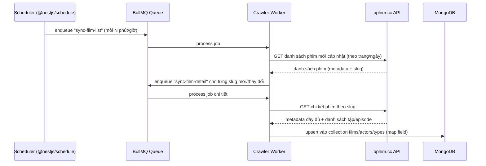

# Backend.md — NestJS

## 1. Framework & phiên bản

- **NestJS 10+** — TypeScript
- **Node.js 20 LTS**
- **Database**: MongoDB (Mongoose ODM) — theo [database_schema.md](database_schema.md)
- **Package manager**: pnpm

## 2. Stack chi tiết

| Hạng mục | Lựa chọn | Lý do |
|---|---|---|
| Framework | NestJS | Kiến trúc module hóa, DI, dễ mở rộng crawler + REST API |
| ORM/ODM | Mongoose (`@nestjs/mongoose`) | Khớp `database_schema.md` |
| Auth | `@nestjs/jwt` + `@nestjs/passport` (JWT + Refresh Token), `bcrypt` | Access token ngắn hạn, refresh token dài hạn |
| Validation | `class-validator` + `class-transformer` | DTO validation cho mọi endpoint |
| API docs | `@nestjs/swagger` | Tự sinh OpenAPI, dùng cho FE team tham chiếu |
| Cache | Redis (`@nestjs/cache-manager` hoặc `ioredis`) | Cache top phim, top bình luận, rating tổng hợp |
| Queue/Cron | `@nestjs/schedule` (cron) + `BullMQ` (`@nestjs/bullmq`) | Lên lịch & xử lý job crawl dữ liệu từ ophim.cc |
| HTTP client (crawler) | `@nestjs/axios` (Axios) | Gọi API ophim.cc |
| Rate limiting | `@nestjs/throttler` | Chống spam bình luận/login, bảo vệ endpoint public |
| Realtime (tùy chọn) | `@nestjs/websockets` (Socket.IO Gateway) | Bình luận realtime, thông báo |
| File/log | `winston` (`nest-winston`) | Log crawler job, lỗi API |
| Testing | Jest (unit) + Supertest (e2e) | Test module theo chuẩn NestJS |
| Container | Docker + Docker Compose (Mongo, Redis, API) | Đồng nhất môi trường dev/prod |
| Security middleware | `helmet`, CORS whitelist, `class-validator` whitelist/forbidNonWhitelisted | Chống XSS/injection cơ bản |

## 3. Cấu trúc module (map theo `database_schema.md`)

```
backend/
├── src/
│   ├── auth/                 # login, register, refresh, forgot-password
│   ├── users/                 # profile, avatar, favorites, history
│   ├── films/                 # CRUD/query films (đọc), endpoint public
│   ├── actors/                 # danh sách/hồ sơ diễn viên
│   ├── types/                  # thể loại (genres)
│   ├── comments/               # bình luận + comment-votes
│   ├── ratings/                # đánh giá phim
│   ├── favorites/              # yêu thích phim/diễn viên (polymorphic)
│   ├── histories/               # lịch sử xem / xem tiếp
│   ├── playlists/               # danh mục do user tạo
│   ├── avatars/                 # type-avatars, img-avatars
│   ├── film-reports/            # báo lỗi phim
│   ├── crawler/                 # module cào dữ liệu từ ophim.cc (chi tiết ở mục 5)
│   ├── common/                  # guards, interceptors, pipes, decorators dùng chung
│   ├── config/                  # ConfigModule (env validation)
│   └── main.ts
├── test/
├── docker-compose.yml
└── .env
```

Mỗi module theo chuẩn NestJS: `*.module.ts`, `*.controller.ts`, `*.service.ts`, `dto/`, `schemas/` (Mongoose schema tương ứng collection trong `database_schema.md`).

## 4. Auth & bảo mật

- **JWT access token** (ngắn hạn, ví dụ 15 phút) + **refresh token** (dài hạn, lưu hashed trong DB hoặc Redis, gửi qua cookie httpOnly).
- Mật khẩu hash bằng `bcrypt`.
- Guard phân quyền: `JwtAuthGuard`, `RolesGuard` (user/admin) — admin dùng cho quản trị crawler/kiểm duyệt bình luận.
- Rate limit riêng cho: login (chống brute-force), tạo bình luận, report phim.
- Input validation toàn cục qua `ValidationPipe({ whitelist: true, forbidNonWhitelisted: true })`.

## 5. Crawler Module — nguồn dữ liệu ophim.cc

### 5.1 Vai trò

Crawler Module chịu trách nhiệm đồng bộ **metadata phim công khai** từ API của **ophim.cc** vào MongoDB nội bộ (collection `films`, `actors`, `types`), để:
- Frontend/API luôn đọc dữ liệu từ MongoDB nội bộ (nhanh, không phụ thuộc uptime của ophim.cc).
- Có thể bổ sung thêm dữ liệu riêng (view count nội bộ, rating, comment) mà không đụng vào nguồn gốc.

### 5.2 Luồng đồng bộ



### 5.3 Thiết kế job

| Job | Tần suất | Nhiệm vụ |
|---|---|---|
| `sync-film-list` | Cron (ví dụ mỗi 30–60 phút) | Lấy danh sách phim mới/cập nhật gần nhất từ ophim.cc theo trang |
| `sync-film-detail` | Trigger từ `sync-film-list` (queue) | Lấy chi tiết 1 phim theo slug: mô tả, poster, diễn viên, danh sách tập (server/episode links) |
| `sync-types` | Cron (hàng ngày) | Đồng bộ danh sách thể loại/quốc gia |
| `retry-failed-jobs` | Tự động (BullMQ retry + backoff) | Xử lý lỗi timeout/rate-limit từ ophim.cc |

### 5.4 Nguyên tắc kỹ thuật

- **Rate limiting khi gọi ophim.cc**: giới hạn số request/giây (ví dụ qua `p-queue` hoặc cấu hình concurrency của BullMQ) để tránh bị chặn IP.
- **Idempotent upsert**: dùng `slug` phim làm khóa duy nhất (`findOneAndUpdate` với `upsert: true`) — chạy lại job không tạo trùng dữ liệu.
- **Mapping tầng dữ liệu**: một service riêng (`OphimMapperService`) chuyển đổi response của ophim.cc sang đúng cấu trúc `films` schema trong `database_schema.md` (field `episodes`, `actors`, `types` dạng ObjectId reference nội bộ — cần resolve/tạo actor & type nếu chưa tồn tại).
- **Không lưu file video**: chỉ lưu URL m3u8/embed gốc từ ophim.cc trong `films.episodes`; không tải/re-host file media.
- **Theo dõi lỗi**: log qua `winston`, alert khi tỉ lệ lỗi job vượt ngưỡng (Sentry/monitoring).
- **Cấu hình bật/tắt & backoff**: toàn bộ tần suất cron, concurrency, retry đều đọc từ biến môi trường để dễ điều chỉnh khi nguồn ophim.cc thay đổi giới hạn.

## 6. Biến môi trường (`.env`)

```
PORT=
MONGODB_URI=
REDIS_URL=
JWT_ACCESS_SECRET=
JWT_ACCESS_EXPIRES=15m
JWT_REFRESH_SECRET=
JWT_REFRESH_EXPIRES=7d
OPHIM_API_BASE_URL=
OPHIM_SYNC_CRON=              # ví dụ: "*/30 * * * *"
OPHIM_REQUEST_CONCURRENCY=
CORS_ORIGIN=
```

## 7. Triển khai

- **Dev**: Docker Compose gồm 3 service — `api` (NestJS), `mongo`, `redis`.
- **Prod**: build image NestJS riêng, deploy lên VPS/Cloud (Docker) hoặc Render/Railway; MongoDB dùng Atlas, Redis dùng managed service (Upstash/Redis Cloud) để giảm vận hành.
- Crawler worker có thể tách thành **process riêng** (`node dist/crawler-worker.js`) chạy độc lập với API server để không ảnh hưởng hiệu năng request người dùng khi job crawl chạy nặng.
- Healthcheck endpoint (`/health`) qua `@nestjs/terminus` cho Mongo/Redis/API để phục vụ load balancer & CI/CD.
