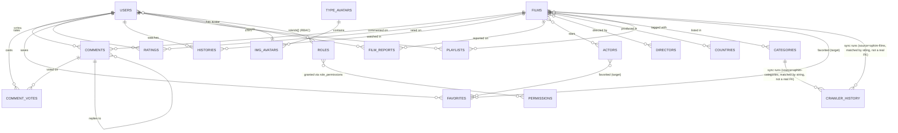

# Database Schema — MongoDB (rophims.cc)

Derived from the feature/API requirement sheet ([Google Sheet](https://docs.google.com/spreadsheets/d/1BQPNftDjPaatJssQfZUDh5de6GncC1Tp2i8qUDm0Pq4)) covering: Trang chủ, Danh sách phim, Diễn viên, Chi tiết phim, Video phim, Đăng nhập/Đăng ký, Quản lý account.

Database engine: **MongoDB** (Mongoose-style field notation used below: `type`, `required`, `default`, `ref`).

**Revision 2 (this pass):** synced with [`api_design.md`](api_design.md) revision 4. Renamed `types`→`categories` and extended it with Ophim-sync fields; added `countries`, `directors`, `roles`, `permissions`, `role_permissions` collections; added `Film.isPublished`, `Comment.isHidden`, `FilmReportStatus:rejected`; added `users.roleIds`; corrected several fields that existed in the actual implementation but were missing from rev 1 of this doc (`users.refreshTokenHash`, `films.sourceSlug`/`sourceUpdatedAt`, `histories.serverName`/`totalDurationSeconds`); added the `crawler_history` collection (existed in code, was never documented here). See §5 for the full list of changes.

---

## 1. Entity overview

| Collection | Purpose | Source requirement |
|---|---|---|
| `users` | Accounts, auth, profile, RBAC role assignment | Đăng nhập/Đăng ký, Quản lý account |
| `films` | Movies & series metadata + episodes | Danh sách phim, Chi tiết phim, Video phim |
| `actors` | Cast/actor directory | Trang diễn viên |
| `directors` | Director directory *(NEW)* | `api_design.md` §10 — normalizes `films.director` off a free-text string |
| `countries` | Country lookup *(NEW)* | `api_design.md` §9 — normalizes `films.country` off a free-text string |
| `categories` | Genre tagging, synced from Ophim's `/the-loai` *(RENAMED from `types`, extended)* | Header/Home "thể loại hot"; `api_design.md` §8 |
| `comments` | Per-film comments, replies, up/down vote counters, soft-moderation | Home + Chi tiết phim |
| `comment_votes` | One vote per user per comment (up/down) | `CommentsController_updateVote` |
| `ratings` | One score per user per film | `RatingsController_*` |
| `favorites` | User's favorite films **or** favorite actors (polymorphic) | `addFavorite`, `addFavoriteCast`, `getFavorite` |
| `histories` | Continue-watching / view history | `addOrRemoteHistory`, `getHistorFilm` |
| `playlists` | User-defined film lists ("danh mục") | `PlayListController_*` |
| `type_avatars` | Avatar categories | `TypeAvatarsController_getTypeAvatar` |
| `img_avatars` | Selectable avatar images per category | `ImgAvatarsController_getImgAvatar` |
| `film_reports` | User-reported broken films/links, now with a rejected outcome | "API báo cáo phim bị lỗi" |
| `crawler_history` | Audit log of every crawler run (films/categories/types) *(NEW — existed in code, undocumented until now)* | `api_design.md` §21 |
| `roles` | RBAC role definitions *(NEW)* | `api_design.md` §2, §22 |
| `permissions` | RBAC permission catalog (`resource:action`) *(NEW)* | `api_design.md` §2, §23 |
| `role_permissions` | Role↔Permission many-to-many join *(NEW)* | `api_design.md` §2 |

**Not a collection:** `user_roles` was considered (per `api_design.md` §1.10) and deliberately **not** created — see §4.6.

---

## 2. Collections

### 2.1 `users`

```js
{
  _id: ObjectId,
  email: { type: String, required: true, unique: true, lowercase: true, trim: true },
  password: { type: String, required: true, select: false },        // hashed
  name: { type: String, default: "" },
  gender: { type: String, enum: ["male", "female", "other"], default: "other" },
  avatar: { type: ObjectId, ref: "img_avatars", default: null },
  role: { type: String, enum: ["user", "admin"], default: "user" },  // legacy — kept for backward compatibility, see §4.6
  roleIds: [{ type: ObjectId, ref: "roles" }],                       // NEW (RBAC) — default: [<seeded "user" role id>]
  isActive: { type: Boolean, default: true },
  resetPasswordToken: { type: String, default: null, select: false },
  resetPasswordExpires: { type: Date, default: null, select: false },
  refreshTokenHash: { type: String, default: null, select: false },  // NEW (doc correction) — hashed refresh token, rotated on use
  createdAt: Date,
  updatedAt: Date,
}
```
**Indexes:** unique `email`; `{ roleIds: 1 }` *(NEW — backs `GET /roles/:id/users`)*.
**Maps to:** `AuthController_handleLogin`, `AuthController_register`, `AuthController_update`, `AuthController_forgotPassword`; RBAC endpoints in `api_design.md` §5.3, §22.

---

### 2.2 `films`

```js
{
  _id: ObjectId,
  slug: { type: String, required: true, unique: true, lowercase: true, trim: true },
  title: { type: String, required: true, trim: true },
  originalTitle: { type: String, default: "" },
  description: { type: String, default: "" },
  posterUrl: String,
  thumbUrl: String,
  trailerUrl: String,
  category: { type: String, enum: ["single", "series"], default: "single" }, // phim lẻ / phim bộ — FORMAT, not genre
  episodeCurrent: { type: String, default: "" },   // e.g. "Tập 12"
  episodeTotal: { type: String, default: "" },
  duration: { type: String, default: "" },
  quality: { type: String, default: "" },          // HD, FHD, 4K...
  language: { type: String, default: "" },         // Vietsub, Thuyết minh... (NOT the MongoDB text-index language — see index note below)
  releaseYear: Number,
  countries: [{ type: ObjectId, ref: "countries" }],  // CHANGED — was a plain string, see §4.1
  directors: [{ type: ObjectId, ref: "directors" }],  // CHANGED — was a plain string, see §4.2
  actors: [{ type: ObjectId, ref: "actors" }],
  categories: [{ type: ObjectId, ref: "categories" }], // RENAMED from `types`, see §4.3
  episodes: [
    {
      serverName: String,                          // e.g. "Server #1"
      items: [
        {
          name: String,                             // e.g. "Tập 1"
          slug: String,
          embedUrl: String,
          m3u8Url: String,
        },
      ],
    },
  ],
  view: { type: Number, default: 0 },
  ratingAvg: { type: Number, default: 0 },
  ratingCount: { type: Number, default: 0 },
  commentCount: { type: Number, default: 0 },
  isHot: { type: Boolean, default: false },
  isPublished: { type: Boolean, default: true },   // NEW — soft-hide moderation state, see §4.4
  status: { type: String, enum: ["ongoing", "completed"], default: "completed" },
  sourceSlug: { type: String, default: null },     // NEW (doc correction) — Ophim's own slug, crawler upsert key
  sourceUpdatedAt: { type: Date, default: null },  // NEW (doc correction) — last crawler sync timestamp
  createdAt: Date,
  updatedAt: Date,
}
```
**Indexes:** unique `slug`; `{ view: -1 }` (top phim); `{ ratingAvg: -1 }`; `{ category: 1 }` (format filter); `{ categories: 1 }` (renamed from `{ types: 1 }`); `{ countries: 1 }` *(NEW, was `{ country: 1 }` on the old string field)*; `{ directors: 1 }` *(NEW)*; `{ isPublished: 1 }` *(NEW — every public query implicitly filters on this)*; text index on `title, originalTitle` (search page) with **`language_override: 'textSearchLanguage'`** *(doc correction — without this, MongoDB's text index reserves the field name `language` for its own stemming-language override, colliding with `films.language` above; values like `"Vietsub"` aren't a valid Mongo text-search language and the write fails without this override)*.
**Maps to:** `FilmsController_findAllPublic`, `FilmsController_findFilmDetail`, `FilmsController_updateView`; drives Slide phim, Top phim, Top 10 phim bộ, Kho tàng anime, Search page, Danh sách phim, Gallery (poster/thumb), Phim đề xuất (query by shared `categories`), Phim bình luận sôi nổi (by `commentCount`) — see `api_design.md` §6.

---

### 2.3 `actors`

```js
{
  _id: ObjectId,
  name: { type: String, required: true, trim: true },
  slug: { type: String, required: true, unique: true, lowercase: true, trim: true },
  avatar: String,
  bio: { type: String, default: "" },
  birthday: Date,
  nationality: { type: String, default: "" },
  createdAt: Date,
  updatedAt: Date,
}
```
**Indexes:** unique `slug`; text index on `name`.
**Maps to:** `ActorsController_findActor` (directory list), `ActorsController_findActorDetail` (actor page → filmography derived by querying `films` where `actors` contains actor `_id`).

---

### 2.4 `directors` *(NEW — mirrors `actors`, see §4.2)*

```js
{
  _id: ObjectId,
  name: { type: String, required: true, trim: true },
  slug: { type: String, required: true, unique: true, lowercase: true, trim: true },
  avatar: { type: String, default: "" },
  bio: { type: String, default: "" },
  birthday: { type: Date, default: null },
  nationality: { type: String, default: "" },
  createdAt: Date,
  updatedAt: Date,
}
```
**Indexes:** unique `slug`; text index on `name`.
**Maps to:** `api_design.md` §10 (`GET /directors`, `GET /directors/:slug` +filmography, admin CRUD).

---

### 2.5 `countries` *(NEW, see §4.1)*

```js
{
  _id: ObjectId,
  name: { type: String, required: true, trim: true },
  slug: { type: String, required: true, unique: true, lowercase: true, trim: true },
  code: { type: String, default: null },  // optional ISO-ish code, not enforced against a real ISO list
  createdAt: Date,
  updatedAt: Date,
}
```
**Indexes:** unique `slug`.
**Maps to:** `api_design.md` §9 (`GET /countries`, `GET /countries/:slug`, admin CRUD).

---

### 2.6 `categories` *(RENAMED from `types`, extended — see §4.3)*

```js
{
  _id: ObjectId,
  name: { type: String, required: true, trim: true },
  slug: { type: String, required: true, unique: true, lowercase: true, trim: true },
  description: { type: String, default: "" },       // NEW — admin-curated, never touched by sync
  seoTitle: { type: String, default: "" },          // NEW — admin-curated, never touched by sync
  seoDescription: { type: String, default: "" },    // NEW — admin-curated, never touched by sync
  source: { type: String, default: null },          // NEW — 'ophim' for synced rows, null if locally created
  sourceSlug: { type: String, default: null },      // NEW — Ophim's own slug, the sync upsert matching key
  sourceUpdatedAt: { type: Date, default: null },   // NEW
  isActive: { type: Boolean, default: true },       // NEW — editorial on/off, never touched by sync
  isHot: { type: Boolean, default: false },         // unchanged from the original `types.isHot`
  createdAt: Date,
  updatedAt: Date,
}
```
**Indexes:** unique `slug`; unique-sparse `sourceSlug` *(NEW — only sync-originated rows have one)*; `{ isActive: 1 }` *(NEW)*; `{ isHot: 1 }`.
**Maps to:** `TypesController_findAllPublic` ("thể loại hot" on home); `api_design.md` §8 (full CRUD + `POST /categories/sync`, `POST /categories/sync/:slug`, `GET /categories/sync/history`, sourced from `https://ophim1.com/the-loai`).

---

### 2.7 `comments`

```js
{
  _id: ObjectId,
  film: { type: ObjectId, ref: "films", required: true },
  user: { type: ObjectId, ref: "users", required: true },
  content: { type: String, required: true, trim: true },
  parent: { type: ObjectId, ref: "comments", default: null }, // reply-to, single level
  upVoteCount: { type: Number, default: 0 },
  downVoteCount: { type: Number, default: 0 },
  isHidden: { type: Boolean, default: false },  // NEW — soft-moderation state, see §4.5
  createdAt: Date,
  updatedAt: Date,
}
```
**Indexes:** `{ film: 1, createdAt: -1 }` (findCommentOrderCreateAt); `{ film: 1, upVoteCount: -1 }` (findCommentVote / top bình luận); `{ createdAt: -1 }` global (findFilmMaxComment aggregated by film); `{ parent: 1 }`.
**Maps to:** `CommentsController_findCommentByFilm`, `CommentsController_create`, `CommentsController_findCommentVote`, `CommentsController_findFilmMaxComment`, `CommentsController_findCommentOrderCreateAt`; `api_design.md` §12 (`PATCH /comments/:id` edit-own, `PATCH /comments/:id/visibility` hide/unhide, `GET /comments` admin moderation feed).

### 2.8 `comment_votes`

```js
{
  _id: ObjectId,
  comment: { type: ObjectId, ref: "comments", required: true },
  user: { type: ObjectId, ref: "users", required: true },
  voteType: { type: String, enum: ["up", "down"], required: true },
  createdAt: Date,
}
```
**Indexes:** unique compound `{ comment: 1, user: 1 }` — enforces one vote per user per comment; updating flips `voteType` and adjusts the counters on `comments`.
**Maps to:** `CommentsController_updateVote`.

---

### 2.9 `ratings`

```js
{
  _id: ObjectId,
  film: { type: ObjectId, ref: "films", required: true },
  user: { type: ObjectId, ref: "users", required: true },
  score: { type: Number, min: 1, max: 10, required: true },
  createdAt: Date,
  updatedAt: Date,
}
```
**Indexes:** unique compound `{ film: 1, user: 1 }`. Writes recompute `films.ratingAvg` / `films.ratingCount`.
**Maps to:** `RatingsController_create`, `RatingsController_updateVote`, `RatingsController_findRatingByFilm`, `RatingsController_getTotalRatingByFilm`; `api_design.md` §6 (`GET /films/top?metric=ratingAvg` surfaces top-rated films using this data).

---

### 2.10 `favorites` (polymorphic: favorite film or favorite actor)

```js
{
  _id: ObjectId,
  user: { type: ObjectId, ref: "users", required: true },
  targetType: { type: String, enum: ["film", "actor"], required: true },
  target: { type: ObjectId, required: true },  // NOT a Mongoose `refPath` today — resolved manually per targetType in service code, see §4.7
  createdAt: Date,
}
```
**Indexes:** unique compound `{ user: 1, targetType: 1, target: 1 }`; `{ user: 1, targetType: 1 }` for listing.
**Maps to:** `UsersController_addFavorite`, `UsersController_addFavoriteCast`, `UsersController_getFavorite`.

---

### 2.11 `histories`

```js
{
  _id: ObjectId,
  user: { type: ObjectId, ref: "users", required: true },
  film: { type: ObjectId, ref: "films", required: true },
  episodeSlug: { type: String, default: "" },          // last watched episode, if series
  serverName: { type: String, default: "" },           // NEW (doc correction) — which episode server was playing
  progressSeconds: { type: Number, default: 0 },        // resume position
  totalDurationSeconds: { type: Number, default: 0 },   // NEW (doc correction) — total length, for progress % on the UI
  lastWatchedAt: { type: Date, default: Date.now },
}
```
**Indexes:** unique compound `{ user: 1, film: 1 }` (upsert on watch, remove on `addOrRemoteHistory` toggle-off); `{ user: 1, lastWatchedAt: -1 }` for "xem tiếp" list.
**Maps to:** `UsersController_addOrRemoteHistory`, `UsersController_getHistorFilm`.

---

### 2.12 `playlists`

```js
{
  _id: ObjectId,
  user: { type: ObjectId, ref: "users", required: true },
  name: { type: String, required: true },          // e.g. "Xem sau"
  films: [{ type: ObjectId, ref: "films" }],
  createdAt: Date,
  updatedAt: Date,
}
```
**Indexes:** `{ user: 1 }`.
**Maps to:** `PlayListController_create`, `PlayListController_update`, `PlayListController_remove`, `PlayListController_findByUser`, `PlayListController_updateByUser` (add film to a list), `PlayListController_removeFilm`.

---

### 2.13 `type_avatars`

```js
{
  _id: ObjectId,
  name: { type: String, required: true, trim: true },   // e.g. "Anime", "Mặc định"
  slug: { type: String, required: true, unique: true, lowercase: true, trim: true },
}
```
**Maps to:** `TypeAvatarsController_getTypeAvatar`; `api_design.md` §18 (`PATCH /avatars/types/:id` added).

### 2.14 `img_avatars`

```js
{
  _id: ObjectId,
  type: { type: ObjectId, ref: "type_avatars", required: true },
  url: { type: String, required: true, trim: true },
  createdAt: Date,
}
```
**Indexes:** `{ type: 1 }`.
**Maps to:** `ImgAvatarsController_getImgAvatar` (filter avatars by `type_avatars`); selected avatar stored on `users.avatar`; `api_design.md` §18 (`PATCH /avatars/images/:id` added).

---

### 2.15 `film_reports`

```js
{
  _id: ObjectId,
  film: { type: ObjectId, ref: "films", required: true },
  user: { type: ObjectId, ref: "users", default: null }, // optional, allow anonymous
  reason: { type: String, required: true, trim: true },
  status: { type: String, enum: ["pending", "resolved", "rejected"], default: "pending" }, // CHANGED — added "rejected", see §4.5
  createdAt: Date,
}
```
**Indexes:** `{ status: 1, createdAt: -1 }`; `{ film: 1 }`.
**Maps to:** "API báo cáo phim bị lỗi" (Trang chi tiết phim); `api_design.md` §17 (`DELETE /film-reports/:id` added).

---

### 2.16 `crawler_history` *(NEW — existed in the actual implementation, was never in this doc until now)*

```js
{
  _id: ObjectId,
  runId: { type: String, required: true, unique: true },       // UUID, one per scheduled/manual run
  source: { type: String, required: true, index: true },       // 'ophim-films' | 'ophim-types' | 'ophim-categories' | ...
  startedAt: { type: Date, required: true },
  finishedAt: { type: Date, required: true },
  durationMs: { type: Number, required: true },
  status: { type: String, enum: ["SUCCESS", "FAILED", "PARTIAL_SUCCESS"], required: true, index: true },
  added: { type: Number, default: 0 },
  updated: { type: Number, default: 0 },
  failed: { type: Number, default: 0 },
  errorMessage: { type: String, default: null },
  cronExpression: { type: String, required: true },
  createdAt: Date,
}
```
**Indexes:** unique `runId`; `{ source: 1, startedAt: -1 }`; `{ status: 1, startedAt: -1 }`.
**Maps to:** `api_design.md` §21 (`GET /crawler-history`, `GET /crawler-history/:id`), §8.3 (Categories sync writes here too, `source:'ophim-categories'`), §25 (`GET /dashboard/crawler-summary` rolls this up).

---

### 2.17 `roles` *(NEW — RBAC, see §4.6)*

```js
{
  _id: ObjectId,
  name: { type: String, required: true, unique: true },  // e.g. "admin", "user", "editor"
  description: { type: String, default: "" },
  isSystem: { type: Boolean, default: false },  // true for seeded "admin"/"user" — protects from delete
  createdAt: Date,
  updatedAt: Date,
}
```
**Indexes:** unique `name`.
**Maps to:** `api_design.md` §22 (`GET/POST/PATCH/DELETE /roles`, `GET/PUT /roles/:id/permissions`, `GET /roles/:id/users`).

### 2.18 `permissions` *(NEW — RBAC, see §4.6)*

```js
{
  _id: ObjectId,
  key: { type: String, required: true, unique: true },  // "resource:action", e.g. "films:create"
  resource: { type: String, required: true },           // "films" — derived from key, stored for filtering
  action: { type: String, required: true },              // "create" — derived from key, stored for filtering
  description: { type: String, default: "" },
  createdAt: Date,
  updatedAt: Date,
}
```
**Indexes:** unique `key`.
**Maps to:** `api_design.md` §23 (`GET/POST/PATCH/DELETE /permissions`).

### 2.19 `role_permissions` *(NEW — RBAC join collection, see §4.6)*

```js
{
  _id: ObjectId,
  role: { type: ObjectId, ref: "roles", required: true },
  permission: { type: ObjectId, ref: "permissions", required: true },
  createdAt: Date,
}
```
**Indexes:** unique compound `{ role: 1, permission: 1 }` — a role can't hold the same permission twice; `{ permission: 1 }` for "which roles grant X" lookups (used when deleting a permission, to cascade-clean).
**Maps to:** `api_design.md` §2 (permission resolution), §22 (`PUT /roles/:id/permissions` bulk-replaces these edges).

---

## 3. Relationship diagram



*(`CRAWLER_HISTORY`'s link to `CATEGORIES`/`FILMS` is conceptual — the `source` field is a free string, not an `ObjectId` ref, since one crawler run touches many documents at once, not a single one. See §2.16.)*

---

## 4. Design notes

- **Polymorphic `favorites`**: favorite films and favorite actors are unified in one collection (`targetType` + `target`) instead of two arrays on `users`, so favorites can scale independently of the user document's 16MB limit and be paginated/queried directly.
- **Vote collections split from parent**: `comment_votes` is separate from `comments` (and `ratings` stores the vote directly on the rating doc) so a user's vote can be looked up/upserted in O(1) via the unique compound index without scanning embedded arrays.
- **Denormalized counters**: `films.view`, `ratingAvg`, `ratingCount`, `commentCount` are maintained by the application on write, avoiding aggregation queries on every page load (home "top phim", film detail header).
- **Embedded `episodes`**: kept inside `films` (not a separate collection) since episodes are always read/written together with their parent film and have no independent query pattern in the sheet. Admin mutation goes through nested-resource endpoints (`api_design.md` §7) using positional array operators, not whole-document replace.

### 4.1 `countries` normalization *(NEW this pass)*
`films.country` was a free-text string (typo/duplicate-prone, e.g. "Việt Nam" vs "Viet Nam", no distinct-list query without an aggregation scan). Replaced with a real `countries` collection + `films.countries: ObjectId[]`, mirroring the existing `actors`/`categories` reference pattern. Ophim's own source data is already an array of `{name, slug}` per movie, so this is a closer fit than a joined string. See `api_design.md` §1.1, §9.

### 4.2 `directors` normalization *(NEW this pass)*
Same rationale as §4.1 — `films.director` was a joined free-text string with no distinct entity, no detail page, no filmography. `directors` schema deliberately mirrors `actors` (a director is, structurally, just another "person" entity with a filmography). See `api_design.md` §1.2, §10.

### 4.3 `types` → `categories` rename, not a duplicate collection *(this pass)*
The original design assumed Ophim had no dedicated genre-list endpoint, so genre tagging stayed a lightweight `types` collection. Ophim's real category source (`https://ophim1.com/the-loai`) returns only `{name, slug}` — confirmed live. Rather than create a second, competing `categories` collection, `types` is **renamed** to `categories` and extended with sync + SEO fields. Because Ophim never supplies `description`/`seoTitle`/`seoDescription`, those are **admin-curated enrichment fields that the sync upsert must never overwrite** — the sync only ever touches `name`/`sourceUpdatedAt` on an existing (`sourceSlug`-matched) row; `slug`, `description`, `seoTitle`, `seoDescription`, `isActive`, and `isHot` are exclusively admin-controlled. See `api_design.md` §1.3, §8.

### 4.4 `Film.isPublished` — soft-hide instead of hard delete *(NEW this pass)*
Hard-deleting a film either orphans references in `comments`/`ratings`/`favorites`/`histories`/`playlists.films`, or requires a real cascade — an unresolved concern from the original design. Adding `isPublished` (default `true`) sidesteps it for the common moderation case: unpublishing hides a film from every public endpoint while every dependent document stays intact and functional. Public endpoints always implicitly filter `isPublished:true`; only an authenticated admin can see/filter unpublished films. Hard `DELETE` still exists for genuine removal and still carries the cascade caveat. See `api_design.md` §6.

### 4.5 New moderation/outcome states *(NEW this pass)*
- `Comment.isHidden` (default `false`) — a **soft**-moderation action distinct from hard-deleting a comment, which risks orphaning replies whose `parent` points at it. Hidden comments are excluded from all public comment listings but keep their vote counts and thread structure intact. See `api_design.md` §12.
- `FilmReportStatus` gains a third value, `rejected` — previously an invalid/spam report and an actually-fixed report both only ever ended at `resolved`; `rejected` distinguishes "reviewed, not a real issue" from `resolved`'s "reviewed, film was fixed." See `api_design.md` §17.

### 4.6 RBAC schema: `roles` / `permissions` / `role_permissions`, and why there's no `user_roles` *(NEW this pass)*
Three new collections implement enterprise role-based access control on top of (not replacing) the existing simple `users.role` enum — `@Roles(ADMIN)`-style checks keep working unchanged during migration; the new system adds fine-grained `resource:action` permission checks on top. `role_permissions` is a real many-to-many join collection because that relationship ("which permissions does a role grant") is bulk-replaced as a set (`PUT /roles/:id/permissions`) and looked up relatively rarely (role-management time, or once per token to hydrate an effective permission set, which is cacheable).

By contrast, **`user_roles` was deliberately not created** — `users.roleIds: ObjectId[] ref roles` is used instead, for two reasons: (1) permission resolution runs on *every authenticated request*, so reading `roleIds` off the already-fetched `User` document is one lookup, while a join collection would add a second query to every single request just to find out which roles a user has; (2) a join collection only earns its keep when the assignment itself carries metadata (granted-by, expires-at, etc.) — nothing in scope needs that. If it's ever needed, `user_roles` can be introduced later without touching `roles`/`permissions`/`role_permissions`. See `api_design.md` §1.10, §2.

### 4.7 Known, non-blocking schema smell: `favorites.target` has no `refPath`
`favorites.target` is a plain `ObjectId` rather than a Mongoose `refPath`-backed polymorphic ref, so `.populate()` can't resolve it automatically — application code must manually branch on `targetType` to decide whether to look up `films` or `actors`. This works today but is a foot-gun if a third favoritable type is ever added (easy to update one branch and forget the other). Flagged for a future pass, not fixed here. See `api_design.md` §1.5.
