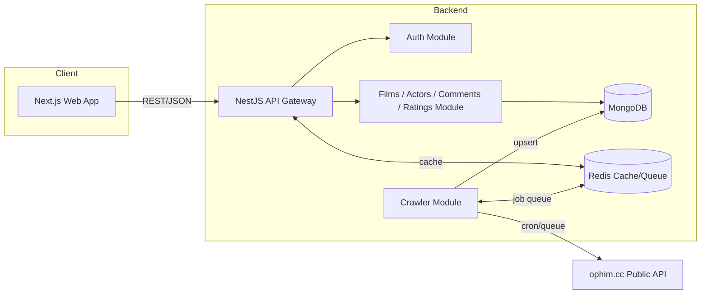

# Project.md — RoPhim Clone

## 1. Mục tiêu

Xây dựng một website xem phim trực tuyến (lấy cảm hứng UI/UX từ rophims.cc / rophim10.online) gồm:
- Trang chủ, danh sách phim, chi tiết phim, trang xem phim (player)
- Trang diễn viên (danh sách + hồ sơ)
- Tài khoản người dùng: đăng nhập/đăng ký, yêu thích, lịch sử xem, danh sách xem sau (playlist)
- Bình luận, đánh giá phim
- Dữ liệu phim (metadata, poster, link tập phim) được đồng bộ tự động từ API công khai **ophim.cc**, không tự lưu trữ/host video.

Tài liệu này mô tả stack kỹ thuật tổng thể. Chi tiết triển khai từng phần nằm ở:
- [frontend.md](frontend.md) — Next.js
- [backend.md](backend.md) — NestJS
- [database_schema.md](database_schema.md) — schema MongoDB (đã có sẵn)
- `design/` — 7 file HTML/Tailwind responsive dùng làm tham chiếu UI (đã hoàn thiện)

## 2. Kiến trúc tổng thể



- **Frontend (Next.js)**: render giao diện, gọi API của backend, không truy cập MongoDB trực tiếp.
- **Backend (NestJS)**: expose REST API cho frontend, quản lý auth/user data, và chạy **Crawler Module** để đồng bộ dữ liệu phim từ ophim.cc theo lịch (cron) vào MongoDB.
- **Nguồn dữ liệu phim**: ophim.cc API (danh sách phim, chi tiết phim, thể loại, quốc gia, tập phim/link m3u8). Backend chỉ lưu metadata + link, không re-encode/host video.

## 3. Tech stack tổng quan

| Layer | Công nghệ | Ghi chú |
|---|---|---|
| Frontend framework | Next.js (App Router) | SSR/ISR cho SEO, CSR cho phần tương tác |
| UI/Styling | Tailwind CSS | Tái sử dụng design tokens từ thư mục `design/` |
| Video player | hls.js / video.js hoặc plyr | Phát m3u8 lấy từ ophim.cc |
| State/data fetching | TanStack Query (React Query) + Server Actions | Cache client-side, đồng bộ với API |
| Backend framework | NestJS (Node.js, TypeScript) | Kiến trúc module hóa |
| Database | MongoDB + Mongoose | Theo `database_schema.md` |
| Cache / Queue | Redis + BullMQ | Cache top phim/bình luận, queue cho crawler |
| Auth | JWT (access + refresh token), bcrypt | Cookie httpOnly hoặc Bearer token |
| Data source phim | ophim.cc public API | Cào định kỳ qua cron job trong backend |
| API docs | Swagger (OpenAPI) | Tự sinh từ NestJS decorators |
| Realtime (tùy chọn) | Socket.IO / WebSocket Gateway (NestJS) | Bình luận realtime, thông báo |
| Containerization | Docker + Docker Compose | Cho backend, MongoDB, Redis |
| CI/CD | GitHub Actions | Lint, test, build, deploy |
| Hosting Frontend | Vercel | Tối ưu cho Next.js |
| Hosting Backend | VPS/Cloud (Docker) hoặc Render/Railway | NestJS + MongoDB Atlas + Redis Cloud |
| Monitoring | Sentry (error tracking), Uptime monitor | Theo dõi lỗi FE/BE |
| Package manager | pnpm | Monorepo-friendly |

## 4. Cấu trúc repo (đề xuất)

```
phim-vibe-coding/
├── frontend/          # Next.js app
├── backend/           # NestJS app
├── design/            # 7 file HTML responsive (tham chiếu UI, đã hoàn thiện)
├── database_schema.md
├── project.md
├── frontend.md
├── backend.md
└── docker-compose.yml
```

Có thể tổ chức thành monorepo (pnpm workspaces / Turborepo) hoặc 2 repo riêng biệt (frontend/backend) tùy quy mô đội ngũ.

## 5. Mapping tính năng ↔ trang (từ `design/`)

| File thiết kế | Trang | Nguồn dữ liệu chính |
|---|---|---|
| `homepage.html` | Trang chủ | films (top/hot), types, comments |
| `moviecategory.html` | Danh sách phim theo thể loại/quốc gia | films, types |
| `moviedentail.html` | Chi tiết phim | films, actors, comments, ratings |
| `watchmovie.html` | Trang xem phim | films.episodes, histories, playlists |
| `actorderectory.html` | Danh sách diễn viên | actors |
| `actorprofile.html` | Hồ sơ diễn viên | actors, films (theo actor) |
| `userdasboard.html` | Trang quản lý tài khoản | users, favorites, histories, playlists, img_avatars |

## 6. Yêu cầu phi chức năng

- **SEO**: metadata động, sitemap.xml, structured data (schema.org Movie) cho trang chi tiết phim — bắt buộc dùng Next.js SSR/ISR cho các trang public.
- **Hiệu năng**: cache Redis cho danh sách top phim/bình luận hot; ảnh poster dùng Next.js Image + CDN.
- **Khả năng mở rộng crawler**: crawler chạy độc lập (queue-based), có retry/backoff khi ophim.cc rate-limit hoặc lỗi.
- **Bảo mật**: validate input (class-validator), rate limiting (throttler), CORS whitelist, helmet, sanitize nội dung bình luận (chống XSS).
- **Pháp lý dữ liệu**: chỉ lưu metadata + link phát công khai từ ophim.cc, không tự ý host/re-encode nội dung có bản quyền.
